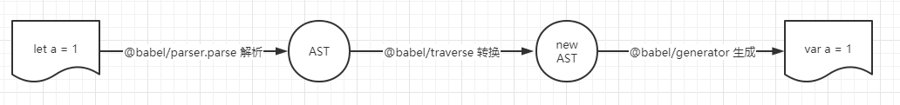
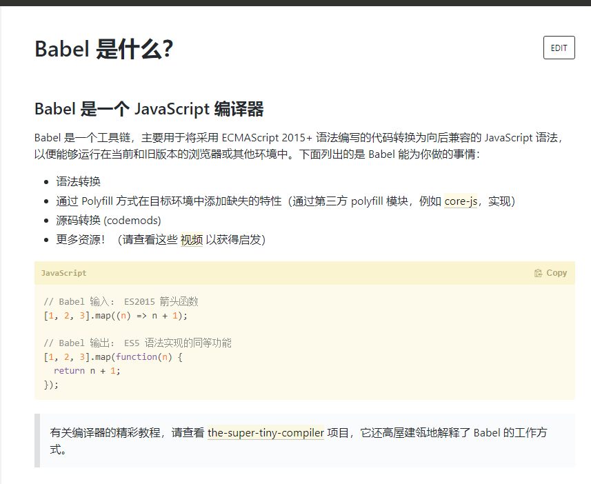

# 深入 babel，打通你的任督二脉

## babel 简单介绍

以下介绍源于[Babel 用户手册](https://github.com/jamiebuilds/babel-handbook/blob/master/translations/zh-Hans/user-handbook.md)

**babel 是一个通用的多用途 JavaScript 编译器。通过 babel 你可以使用（并创建）下一代的 JavaScript，以及下一代的 JavaScript 工具。**

作为一种语言，JavaScript 在不断发展，新的标准／提案和新的特性层出不穷。 在得到广泛普及之前，babel 能够让你提前（甚至数年）使用它们。

babel 把用最新标准编写的 JavaScript 代码向下编译成可以在今天随处可用的版本。** 这一过程叫做“源码到源码”编译， 也被称为转换编译（transpiling，是一个自造合成词，即转换＋编译。以下也简称为转译）。**

例如，babel 能够将新的 ES2015 箭头函数语法：

```js
const square = n => n * n;
```

转译为：

```js
const square = function square(n) {
  return n * n;
};
```

不过 babel 的用途并不止于此，它支持语法扩展，能支持像 React 所用的 JSX 语法，同时还支持用于静态类型检查的流式语法（Flow Syntax）。例如在 babel7 以后就可以编译 typescript 代码，这是 typescript 团队和 babel 团队合作一年的成果。

**更重要的是，babel 的一切都是简单的插件，谁都可以创建自己的插件，利用 Babel 的全部威力去做任何事情。**

有关 babel 的官方插件，参见[Babel 的官方插件实现](https://github.com/babel/babel/tree/master/packages)。

有关 babel 如何编写插件，参见[Babel 插件手册](https://github.com/jamiebuilds/babel-handbook/blob/master/translations/zh-Hans/plugin-handbook.md)。

由于这篇文章是对 Babel 的深入了解，所以对于 Babel 具体的介绍和使用配置，这里就不做过多的介绍，具体的使用可以阅读 [Babel 官方手册](https://github.com/jamiebuilds/babel-handbook)和[官方文档](https://babeljs.io/)，或者我的[另一篇笔记](https://github.com/blackCY/Babel/blob/main/knowledge.md)

### babel 名字的由来

babel 最开始叫 6to5，也就是 es6 转 es5，但是后来随着 es 标准的演进，有了 es7、es8 等，6to5 的名字已经不适合了，所以改名为 babel。

babel 是[巴别塔](https://baike.baidu.com/item/%E5%B7%B4%E5%88%AB%E5%A1%94/67557?fr=aladdin)的意思，来自圣经中的典故：

> 当时人类联合起来兴建希望能通往天堂的高塔，为了阻止人类的计划，上帝让人类说不同的语言，使人类相互之间不能沟通，计划因此失败，人类自此各散东西。此事件，为世上出现不同语言和种族提供解释。这座塔就是巴别塔。

这很符合 babel 的定位。

### babel 没钱了？

了解了 Babel 的一些知识，下面来看一下 Babel 的近况：

- [每月 1.17 亿次下载的 babel，没钱了](https://mp.weixin.qq.com/s/y9b2gGePE_oRLrGP6XXwpw)

## babel 用途

我们平时主要用 babel 来做 3 件事情：

- 转译 esnext、typescript、flow 等到目标环境支持的 js

  这个是最常用的功能，用来把代码中的 esnext 的新的语法、typescript 和 flow 的语法转成基于目标环境支持的语法的实现。并且还可以把目标环境不支持的 api 进行 polyfill。

  babel 7 支持了 preset-env，可以指定 targets 来进行按需转换，转换更加的精准，产物更小。

- 一些特定用途的代码转换

  babel 是一个转译器，暴露了很多 api，用这些 api 可以完成代码到 AST 的 parse，AST 的转换，以及目标代码的生成。

  开发者可以用它来来完成一些特定用途的转换，比如函数插桩（函数中自动插入一些代码，例如埋点代码）、自动国际化、default import 转 named import 等。这些都是后面的实战案例。

  现在比较流行的小程序转译工具 taro，就是基于 babel 的 api 来实现的。

- 代码的静态分析

  对代码进行 parse 之后，能够进行转换，是因为通过 AST 的结构能够理解代码。理解了代码之后，除了进行转换然后生成目标代码之外，也同样可以用于分析代码的信息，进行一些检查。

  - linter 工具就是分析 AST 的结构，对代码规范进行检查。
  - api 文档自动生成工具，可以提取源码中的注释，然后生成文档。
  - type checker 会根据从 AST 中提取的或者推导的类型信息，对 AST 进行类型是否一致的检查，从而减少运行时因类型导致的错误。
  - 压缩混淆工具，这个也是分析代码结构，进行删除死代码、变量名混淆、常量折叠等各种编译优化，生成体积更小、性能更优的代码。
  - js 解释器，除了对 AST 进行各种信息的提取和检查以外，我们还可以直接解释执行 AST。

上面讲述了 babel 的 3 种主要用途，对于这些用途我们看完之后可能还是不太了解，那么别着急，先让我们从 babel 的编译流程以及 AST 入手，待了解了这些之后，再来看 babel 的这 3 种用途，就会豁然开朗一些。

## babel 的编译流程

开篇我们就介绍了 babel 是一个编译器，更确切地说是**源码到源码的编译器，通常也叫做“转换编译器（transpiler）”**。 也就是说我们为 Babel 提供一些 JavaScript 代码，Babel 更改这些代码，然后返回给你新生成的代码。

而这个处理过程的每一步都涉及到创建或是操作[抽象语法树](https://en.wikipedia.org/wiki/Abstract_syntax_tree)，也就是我们常说的 AST。

### Abstract Syntax Tree

babel 编译的第一步是把源码 parse 成抽象语法树 AST （Abstract Syntax Tree），后续对这个 AST 进行转换。（之所以叫抽象语法树是因为省略掉了源码中的分隔符、注释等内容）。

**抽象语法树（Abstract Syntax Tree）简称 AST ，是以树状形式表现编程语言的语法结构，树上的每个节点都表示源代码中的一种结构。**JavaScript 引擎工作的第一步就是将代码解析为 AST，如果你想了解 js 编译执行的原理，那么你就得了解 AST，目前前端常用的一些插件或者工具，比如说 `javascript 转译`、`代码压缩`、`css 预处理器`、`eslint`、`pretiier` 等功能的实现，**都是建立在 AST 的基础之上**。

那么 AST 长什么样子呢？

我们可以通过[这个网站](https://astexplorer.net/)生成出对应代码的 AST 结构，而且不止 JavaScript 的 AST，许多语言的 AST 结构都可以在这个网站上面看到。

比如下面的函数：

```js
function square(n) {
  return n * n;
}
```

这段代码可以被表示成如下的一棵树：

```
- FunctionDeclaration:
  - id:
    - Identifier:
      - name: square
  - params [1]
    - Identifier
      - name: n
  - body:
    - BlockStatement
      - body [1]
        - ReturnStatement
          - argument
            - BinaryExpression
              - operator: *
              - left
                - Identifier
                  - name: n
              - right
                - Identifier
                  - name: n
```

或是如下所示的 JavaScript Object（对象）：

```json
{
  "type": "FunctionDeclaration",
  "id": {
    "type": "Identifier",
    "name": "square"
  },
  "params": [
    {
      "type": "Identifier",
      "name": "n"
    }
  ],
  "body": {
    "type": "BlockStatement",
    "body": [
      {
        "type": "ReturnStatement",
        "argument": {
          "type": "BinaryExpression",
          "operator": "*",
          "left": {
            "type": "Identifier",
            "name": "n"
          },
          "right": {
            "type": "Identifier",
            "name": "n"
          }
        }
      }
    ]
  }
}
```

你会留意到 AST 的每一层都拥有相同的结构：

```json
{
  type: "FunctionDeclaration",
  id: {...},
  params: [...],
  body: {...}
}
```

```json
{
  type: "Identifier",
  name: ...
}
```

```json
{
  type: "BinaryExpression",
  operator: ...,
  left: {...},
  right: {...}
}
```

这样的每一层结构也被叫做 **节点（Node）**。 **一个 AST 可以由单一的节点或是成百上千个节点构成。 它们组合在一起可以描述用于静态分析的程序语法。**

每一个节点都有如下所示的接口（Interface）：

```ts
interface Node {
  type: string;
}
```

> Babel 使用一个基于 [ESTree](https://github.com/estree/estree) 并修改过的 AST，它的内核说明文档可以在[这里](https://github.com/babel/babel/blob/master/packages/babel-parser/ast/spec.md)找到。

字符串形式的 `type` 字段表示节点的类型（如： `"FunctionDeclaration"`，`"Identifier"`，或 `"BinaryExpression"`）。 每一种类型的节点定义了一些附加属性用来进一步描述该节点类型。

可以在下面这几篇文章中看一下具体的节点类型的定义：

- [抽象语法树 AST 介绍](http://www.goyth.com/2018/12/23/AST/)
- [JavaScript 常见 AST 梳理](https://mp.weixin.qq.com/s/biQt6cw05-4G-gkJS9fGTQ)

Babel 还为每个节点额外生成了一些属性，用于描述该节点在原始代码中的位置。

```json
{
  type: ...,
  start: 0,
  end: 38,
  loc: {
    start: {
      line: 1,
      column: 0
    },
    end: {
      line: 3,
      column: 1
    }
  },
  ...
}
```

每一个节点都会有 `start`，`end`，`loc` 这几个属性，以及其他公共属性：

- `type`： AST 节点的类型
- `start、end、loc`：start 和 end 代表该节点对应的源码字符串的开始和结束下标，不区分行列。而 loc 属性是一个对象，有 line 和 column 属性分别记录开始和结束行列号。
- `leadingComments、innerComments、trailingComments`： 表示开始的注释、中间的注释、结尾的注释，因为每个 AST 节点中都可能存在注释，而且可能在开始、中间、结束这三种位置，通过这三个属性来记录和 Comment 的关联。
- `extra`：记录一些额外的信息，用于处理一些特殊情况。

### JavaScript 编译执行流程

了解了 AST 是什么之后，我们再来看看 AST 是如何生成的。

**在 JavaScript 中，js 执行的第一步是读取 js 文件中的字符流，然后通过词法分析生成 token，之后再通过语法分析生成 AST（Abstract Syntax Tree），最后生成机器码执行。**

#### 词法分析

词法分析，也称之为扫描（scanner），简单来说就是调用 next() 方法，一个一个字母的来读取字符，然后与定义好的 JavaScript 关键字符做比较，生成对应的 Token。Token 是一个不可分割的最小单元，例如 var 这三个字符，它只能作为一个整体，语义上不能再被分解，因此它是一个 Token。词法分析器里，每个关键字是一个 Token ，每个标识符是一个 Token，每个操作符是一个 Token，每个标点符号也都是一个 Token。除此之外，还会过滤掉源程序中的注释和空白字符（换行符、空格、制表符等）。

当词法分析源代码的时候，它会一个一个字母地读取代码，所以很形象地称之为扫描-scans；当它遇到空格，操作符，或者特殊符号的时候，它会认为一个话已经完成了。

最终，整个代码将被分割进一个 tokens 列表（或者说一维数组）。

```js
n * n;
```

```json
[
  { type: { ... }, value: "n", start: 0, end: 1, loc: { ... } },
  { type: { ... }, value: "*", start: 2, end: 3, loc: { ... } },
  { type: { ... }, value: "n", start: 4, end: 5, loc: { ... } },
  ...
]
```

每一个 type 有一组属性来描述该令牌：

```json
{
  type: {
    label: 'name',
    keyword: undefined,
    beforeExpr: false,
    startsExpr: true,
    rightAssociative: false,
    isLoop: false,
    isAssign: false,
    prefix: false,
    postfix: false,
    binop: null,
    updateContext: null
  },
  ...
}
```

和 AST 节点一样它们也有 `start`，`end`，`loc` 属性。

#### 语法分析

语法分析会将词法分析出来的 Token 转化成有语法含义的抽象语法树（AST）结构。同时，验证语法，语法如果有错的话，抛出语法错误。

当生成树的时候，解析器会删除一些没必要的标识tokens（比如不完整的括号），因此AST不是100%与源码匹配的，但是已经能让我们知道如何处理了。说个题外话，解析器100%覆盖所有代码结构生成树叫做CST（具体语法树）。


#### the-super-tiny-compiler

想要学习更多关于编译器的知识？ [the-super-tiny-compiler](https://github.com/jamiebuilds/the-super-tiny-compiler)，一个贼好的项目。大概200来行代码，几乎每行都有注释。

### babel 的编译流程

Babel 的三个主要处理步骤分别是： **解析（parse）**，**转换（transform）**，**生成（generate）**。

- 解析（parse）：**解析**步骤接收代码并输出 AST
- 转换（transform）：[转换](https://en.wikipedia.org/wiki/Program_transformation)步骤接收 AST 并对其进行遍历，在此过程中对节点进行添加、更新及移除等操作。 这是 Babel 或是其他编译器中最复杂的过程 同时也是插件将要介入工作的部分。
- 生成（generate）：[代码生成](<https://en.wikipedia.org/wiki/Code_generation_(compiler)>)步骤把最终（经过一系列转换之后）的 AST 转换成字符串形式的代码，同时还会创建[源码映射（source maps）](http://www.html5rocks.com/en/tutorials/developertools/sourcemaps/)。代码生成其实很简单：`深度优先`遍历整个 AST，然后构建可以表示转换后代码的字符串。



#### @babel/parse

Babel Parser 是 Babel 的解析器。最初是从 Acorn（Acorn 后面有具体介绍） 项目 fork 出来的。Acorn 非常快，易于使用，并且针对非标准特性(以及那些未来的标准特性) 设计了一个基于插件的架构。

parse 阶段的目的是把源码字符串转换成机器能够理解的 AST，这个过程分为词法分析、语法分析。

比如 `let name = 'guang';` 这样一段源码，我们要先把它分成一个个不能细分的单词（token），也就是 `let`, `name`, `=`, `'guang'`，这个过程是词法分析，按照单词的构成规则来拆分字符串成单词。

之后要把 token 进行递归的组装，生成 AST，这个过程是语法分析，按照不同的语法结构，来把一组单词组合成对象。


```js
import parser from '@babel/parser';

const code = `function square(n) {
  return n * n;
}`;

parser.parse(code);
// Node {
//   type: "File",
//   start: 0,
//   end: 38,
//   loc: SourceLocation {...},
//   program: Node {...},
//   comments: [],
//   tokens: [...]
// }
```

#### @babel/traverse

**Babel Traverse（遍历）模块维护了整棵树的状态，并且负责替换、移除和添加节点。**

transform 阶段是对 parse 生成的 AST 的处理，会进行 AST 的遍历，遍历的过程中处理到不同的 AST 节点会调用注册的相应的 visitor 函数，visitor 函数里可以对 AST 节点进行增删改，返回新的 AST（可以指定是否继续遍历新生成的 AST）。这样遍历完一遍 AST 之后就完成了对代码的修改。


我们可以和 Babel Parser 一起使用来遍历和更新节点：

```js
import parser from '@babel/parser';
import traverse from '@babel/traverse';

const code = `function square(n) {
  return n * n;
}`;

const ast = parser.parse(code);

traverse(ast, {
  enter(path) {
    if (path.node.type === 'Identifier' && path.node.name === 'n') {
      path.node.name = 'x';
    }
  },
});
```

#### @babel/generator

Babel Generator 模块是 Babel 的代码生成器，它读取 AST 并将其转换为代码和源码映射(sourcemaps)。

generate 阶段会把 AST 打印成目标代码字符串，并且会生成 sourcemap。不同的 AST 对应的不同结构的字符串。比如 `IfStatement` 就可以打印成 `if(test) {}` 格式的代码。这样从 AST 根节点进行递归打印，就可以生成目标代码的字符串。


sourcemap 记录了源码到目标代码的转换关系，通过它我们可以找到目标代码中每一个节点对应的源码位置。

```js
import parser from '@babel/parser';
import generate from '@babel/generator';

const code = `function square(n) {
  return n * n;
}`;

const ast = parser.parse(code);

generate(ast);
// {
//   code: "...",
//   map: "..."
// }
```

#### 一个简单的示例：

```js
const parser = require('@babel/parser');
const generator = require('@babel/generator').default;
const traverse = require('@babel/traverse').default;

const code = `
  function square(n) {
    return n * n;
  }
`;

const ast = parser.parse(code);

traverse(ast, {
  Identifier(path) {
    if (path.node.name === 'n') {
      path.node.name = 'x';
    }
  },
});

const res = generator(ast);

console.log(res);
/*
  {
    code: 'function square(x) {\n  return x * x;\n}',     
    map: null,
    rawMappings: undefined
  }
*/
```

我们在上文已经接触了词法分析、语法分析、Tokens 以及 babel 里的节点，例如 VariableDrclaration、Identifier 等，那么 visitor 函数又是什么呢？别着急，我们往下看。

#### 遍历

想要转换 AST 你需要进行递归的[树形遍历](https://en.wikipedia.org/wiki/Tree_traversal)。

这里仍然借用上述函数：

```js
function square(n) {
  return n * n;
}
```

比方说我们有一个 `FunctionDeclaration` 类型。它有几个属性：`id`，`params`，和 `body`，每一个都有一些内嵌节点。

```json
{
  "type": "FunctionDeclaration",
  "id": {
    "type": "Identifier",
    "name": "square"
  },
  "params": [
    {
      "type": "Identifier",
      "name": "n"
    }
  ],
  "body": {
    "type": "BlockStatement",
    "body": [
      {
        "type": "ReturnStatement",
        "argument": {
          "type": "BinaryExpression",
          "operator": "*",
          "left": {
            "type": "Identifier",
            "name": "n"
          },
          "right": {
            "type": "Identifier",
            "name": "n"
          }
        }
      }
    ]
  }
}
```

于是我们从 `FunctionDeclaration` 开始并且我们知道它的内部属性（即：`id`，`params`，`body`），所以我们依次访问每一个属性及它们的子节点。

接着我们来到 `id`，它是一个 `Identifier`。`Identifier` 没有任何子节点属性，所以我们继续。

之后是 `params`，由于它是一个数组节点所以我们访问其中的每一个，它们都是 `Identifier` 类型的单一节点，然后我们继续。

此时我们来到了 `body`，这是一个 `BlockStatement` 并且也有一个 `body`节点，而且也是一个数组节点，我们继续访问其中的每一个。

这里唯一的一个属性是 `ReturnStatement` 节点，它有一个 `argument`，我们访问 `argument` 就找到了 `BinaryExpression`。.

`BinaryExpression` 有一个 `operator`，一个 `left`，和一个 `right`。 Operator 不是一个节点，它只是一个值因此我们不用继续向内遍历，我们只需要访问 `left` 和 `right`。.

Babel 的转换步骤全都是这样的遍历过程。

#### Visitors（访问者）

当我们谈及“进入”一个节点，实际上是说我们在**访问**它们， 之所以使用这样的术语是因为有一个[**访问者模式（visitor）**](https://en.wikipedia.org/wiki/Visitor_pattern)的概念。

visitor 模式（访问者模式）是 23 种经典设计模式中的一种。当被操作的对象结构比较稳定，而操作对象的逻辑经常变化的时候，通过分离逻辑和对象结构，使得他们能独立扩展。这就是 visitor 模式的思想。

关于访问者模式，可以具体看一下[精读《设计模式 - Visitor 访问者模式》](https://mp.weixin.qq.com/s/QE1MovBK8wvQY9XbqPYuoQ)。

访问者是一个用于 AST 遍历的跨语言的模式。 简单的说它们就是一个对象，定义了用于在一个树状结构中获取具体节点的方法。 这么说有些抽象所以让我们来看一个例子。

```js
const MyVisitor = {
  Identifier() {
    console.log('Called!');
  },
};

// 你也可以先创建一个访问者对象，并在稍后给它添加方法。
let visitor = {};
visitor.MemberExpression = function () {};
visitor.FunctionDeclaration = function () {};
```

> **注意**： `Identifier() { ... }` 是 `Identifier: { enter() { ... } }` 的简写形式。

这是一个简单的访问者，把它用于遍历中时，每当在树中遇见一个 `Identifier` 的时候会调用 `Identifier()` 方法。

所以在下面的代码中 `Identifier()` 方法会被调用四次（包括 `square` 在内，总共有四个 `Identifier`）。)

```js
function square(n) {
  return n * n;
}
```

```js
path.traverse(MyVisitor);
Called!
Called!
Called!
Called!
```

这些调用都发生在**进入**节点时，不过有时候我们也可以在**退出**时调用访问者方法。

假设我们有一个树状结构：

```
- FunctionDeclaration
  - Identifier (id)
  - Identifier (params[0])
  - BlockStatement (body)
    - ReturnStatement (body)
      - BinaryExpression (argument)
        - Identifier (left)
        - Identifier (right)
```

当我们向下遍历这颗树的每一个分支时我们最终会走到尽头，于是我们需要往上遍历回去从而获取到下一个节点。 向下遍历这棵树我们**进入**每个节点，向上遍历回去时我们**退出**每个节点。

让我们以上面那棵树为例子走一遍这个过程。

- 进入 `FunctionDeclaration`
  - 进入 `Identifier (id)`
  - 走到尽头
  - 退出 `Identifier (id)`
  - 进入 `Identifier (params[0])`
  - 走到尽头
  - 退出 `Identifier (params[0])`
  - 进入 `BlockStatement (body)`
  - 进入 `ReturnStatement (body)`
    - 进入 `BinaryExpression (argument)`
    - 进入 `Identifier (left)`
      - 走到尽头
    - 退出 `Identifier (left)`
    - 进入 `Identifier (right)`
      - 走到尽头
    - 退出 `Identifier (right)`
    - 退出 `BinaryExpression (argument)`
  - 退出 `ReturnStatement (body)`
  - 退出 `BlockStatement (body)`
- 退出 `FunctionDeclaration`

所以当创建访问者时你实际上有两次机会来访问一个节点。

```js
const MyVisitor = {
  Identifier: {
    enter() {
      console.log('Entered!');
    },
    exit() {
      console.log('Exited!');
    },
  },
};
```

如有必要，你还可以把方法名用`|`分割成`Idenfifier | MemberExpression`形式的字符串，把同一个函数应用到多种访问节点。

在[flow-comments](https://github.com/babel/babel/blob/2b6ff53459d97218b0cf16f8a51c14a165db1fd2/packages/babel-plugin-transform-flow-comments/src/index.js#L47) 插件中的例子如下：

```js
const MyVisitor = {
  'ExportNamedDeclaration|Flow'(path) {},
};
```

你也可以在访问者中使用别名(如[babel-types](https://github.com/babel/babel/tree/master/packages/babel-types/src/definitions)定义)。例如，

`Function` is an alias for `FunctionDeclaration`, `FunctionExpression`, `ArrowFunctionExpression`, `ObjectMethod` and `ClassMethod`.

```js
const MyVisitor = {
  Function(path) {},
};
```

可以在[文档中](https://babeljs.io/docs/en/babel-types)查到某个 AST 类型的别名是啥，某个别名都包含哪些 AST 类型可以在[babel-types 的类型定义](https://github.com/babel/babel/blob/main/packages/babel-types/src/ast-types/generated/index.ts#L2489-L2535)处查。

建议把 @babel/types 源码下载下来看，类型定义在 `src/ast-types/generated` 目录下，这样可以利用 ide 的功能方便的查看每种 alias 的具体 AST 类型。


所有的 AST 相关的信息都可以在[babel-types](https://github.com/babel/babel/blob/main/packages/babel-types/src/definitions/core.ts)里查看，每一个 AST 节点怎么创建、怎么校验、怎么遍历，其实都与 AST 的结构有关系，这些都在 babel-types 里面定义。

比如 if 就定义了有哪些属性可以遍历、别名是什么，每一个属性怎么校验，然后会根据这些规则生成 xxx，isXxx，assertXxx 等 api 用于创建、判断 AST 节点。


#### Paths（路径）

AST 通常会有许多节点，那么节点直接如何相互关联呢？ 我们可以使用一个可操作和访问的巨大可变对象表示节点之间的关联关系，或者也可以用**Paths**（路径）来简化这件事情。

**Path** 是表示两个节点之间连接的对象。

例如，如果有下面这样一个节点及其子节点︰

```json
{
  type: "FunctionDeclaration",
  id: {
    type: "Identifier",
    name: "square"
  },
  ...
}
```

将子节点 `Identifier` 表示为一个路径（Path）的话，看起来是这样的：

```json
{
  "parent": {
    "type": "FunctionDeclaration",
    "id": {...},
    ....
  },
  "node": {
    "type": "Identifier",
    "name": "square"
  }
}
```

同时它还包含关于该路径的其他元数据：

```json
{
  "parent": {...},
  "node": {...},
  "hub": {...},
  "contexts": [],
  "data": {},
  "shouldSkip": false,
  "shouldStop": false,
  "removed": false,
  "state": null,
  "opts": null,
  "skipKeys": null,
  "parentPath": null,
  "context": null,
  "container": null,
  "listKey": null,
  "inList": false,
  "parentKey": null,
  "key": null,
  "scope": null,
  "type": null,
  "typeAnnotation": null
}
```

它们各自的含义：

- path.node 当前 AST 节点
- path.parent 父 AST 节点
- path.parentPath 父 AST 节点的 path
- path.scope 作用域，见下文详解
- path.hub 可以通过 path.hub.file 拿到最外层 File 对象， path.hub.getScope 拿到最外层作用域，path.hub.getCode 拿到源码字符串
- path.container 当前 AST 节点所在的父节点属性的属性值
- path.key 当前 AST 节点所在父节点属性的属性名或所在数组的下标
- path.listkey 当前 AST 节点所在父节点属性的属性值为数组时 listkey 为该属性名，否则为 undefined

当然路径对象还包含添加、更新、移动和删除节点有关的其他很多方法，这里就不做过多的探讨，具体的可以阅读[babel 插件手册](https://github.com/jamiebuilds/babel-handbook/blob/master/translations/en/plugin-handbook.md) 和 [我的笔记](https://github.com/blackCY/Babel/blob/main/knowledge.md)

在某种意义上，路径是一个节点在树中的位置以及关于该节点各种信息的响应式 **Reactive** 表示。 当你调用一个修改树的方法后，路径信息也会被更新。 Babel 帮你管理这一切，从而使得节点操作简单，尽可能做到无状态。

##### Paths in Visitors（存在于访问者中的路径）

当你有一个 `Identifier()` 成员方法的访问者时，你实际上是在访问路径而非节点。 通过这种方式，你操作的就是节点的响应式表示（译注：即路径）而非节点本身。

```js
const MyVisitor = {
  Identifier(path) {
    console.log('Visiting: ' + path.node.name);
  },
};
```

```js
a + b + c;
```

```js
path.traverse(MyVisitor);
Visiting: a;
Visiting: b;
Visiting: c;
```

#### JS 解析器的历史

AST 也是有标准的，JS parser 的 AST 大多是 [estree 标准](https://github.com/estree/estree)，从 SpiderMonkey 的 AST 标准扩展而来。**babel 的整个编译流程都是围绕 AST 来的。**

##### SpiderMonkey 和 estree 标准

在 nodejs 出现之后，前端可以用 nodejs 来做一些工程化的事情，也就有了 js parser 的需求，当时 Mozilla 在 MDN 上公布了 SpiderMonkey（c++ 写的 js 引擎）的 parser api 和 AST 标准，所以当时最早的 JS parser ---- [esprima](https://github.com/jquery/esprima) 就是基于 SpiderMonkey 的 AST 标准来实现的，后来形成了 [estree 标准](https://github.com/estree/estree)。 当时很多的前端领域的工具都基于 esprima。

但是到了 2015 年之后，es 标准一年一个版本，而 esprima 的更新速度跟不上，它跟不上也就导致了依赖它的一系列工具都跟不上，所以 eslint 就 fork 了一份 esprima，做了一些扩展，来自己实现新语法的 parse，这就是 espree，它依然是 estree 标准的。

##### acorn

后面出现了 [acorn](https://github.com/acornjs/acorn)，也是 estree 标准的实现，但是他的速度比 esprima 快，而且支持插件，可以通过插件扩展语法支持。正是速度快加上支持插件让很多工具都转而使用 acorn。

eslint 的 parser ---- espree 本来是 fork 自 esprima，但后来 espree 2.0 基于 acorn 重新实现了，也使用 acorn 的插件机制来扩展语法。

babel parser(babylon) 也是基于 acorn，并且对 AST 节点和属性都做了扩展，也提供了一些支持 typescript、jsx、flow 的插件（就是我们可以在 @babel/parser 的 plugins 里面指定的那些）。

##### js parser 之间的关系


它们的关系如图所示，estree 标准是基于 SpiderMonkey 的 AST 标准扩展的，它的实现有 esprima、acorn 等，现在 espree、babel parser 都是基于 acorn 做的扩展，因为 acorn 提供了插件机制。

当然也不是所有的 js parser 都是 estree 标准的，比如 terser、typescript 等都有自己的 AST 标准。

##### babel parser 对 estree AST 的扩展

babel 基于 acorn 插件对 estree AST 做了如下扩展。

- 把 Literal 替换成了 StringLiteral、NumericLiteral、 BigIntLiteral、 BooleanLiteral、 NullLiteral、 RegExpLiteral
- 把 Property 替换成了 ObjectProperty 和 ObjectMethod
- 把 MethodDefinition 替换成了 ClassMethod
- Program 和 BlockStatement 支持了 directives 属性，也就是 'use strict' 等指令的解析，对应的 ast 是 Directive 和 DirectiveLiteral
- ChainExpression 替换为了 ObjectMemberExpression 和 OptionalCallExpression
- ImportExpression 替换为了 CallExpression 并且 callee 属性设置为 Import。

这些可以在 [babel parser 的文档](https://babeljs.io/docs/en/babel-parser#output)里看到。

##### acorn 插件

babel parser 基于 acorn 扩展了一些语法，那它是怎么扩展的呢？ 我们写一个 acorn 插件来感受一下。

acorn 主要是一个 Parser 类，不同的方法实现了不同的逻辑，插件扩展就是继承这个 Parser，重写一些方法。

acorn 的 api 如下，其中 acorn-jsx、acorn-bigint 就是 acorn 插件。

```js
const { Parser } = require('acorn');

const MyParser = Parser.extend(require('acorn-jsx')(), require('acorn-bigint'));
console.log(MyParser.parse('// Some bigint + JSX code'));
```

插件是一个函数，接收之前的 Parser，返回扩展以后的 Parser。

```js
module.exports = function noisyReadToken(Parser) {
  return class extends Parser {
    readToken(code) {
      console.log('Reading a token!');
      super.readToken(code);
    }
  };
};
```

接下来我们写一个 acorn 插件：

> 给 javascript 一个关键字 guang，可以作为 statement 单独使用

我们知道 parse 的过程其实就是`分词` + `组装 AST`这两步（一般叫词法分析和语法分析），我们只要实现这两步就可以了。

###### 分词（词法分析）

我们是想增加一个关键字，acorn 有 keywords 属性，是一个正则表达式，用来做关键字拆分，所以我们重写 keywords 属性就可以。并且还要为新的关键字注册一个 token 类型。

acorn Parser 的入口方法是 parse，我们要在 parse 方法里面设置 keywords。

```js
parse(program) {
  var newKeywords = "break case catch continue debugger default do else finally for function if return switch throw try var while with null true false instanceof typeof void delete new in this const class extends export import super";
  newKeywords += " guang";// 增加一个关键字
  this.keywords = new RegExp("^(?:" + newKeywords.replace(/ /g, "|") + ")$")

  return(super.parse(program));
}
```

然后注册一个新的 token 类型来标识它。

```js
Parser.acorn.keywordTypes['guang'] = new TokenType('guang', { keyword: 'guang' });
```

这样 acorn 就会在 parse 的时候分出 `guang` 这个关键字。

###### 组装 AST（语法分析）

光分出 token 是没意义的，要组装到 AST 中。

acorn 在 parse 到不同类型的节点会调用不同的 parseXxx 方法，因为我们是在 statement 里面用，那么就要重写 parseStatement 方法，在里面组装新的 statement 节点。

```js
parseStatement(context, topLevel, exports) {
  var tokenType = this.type;

  if (tokenType == Parser.acorn.keywordTypes["guang"]) {
    var node = this.startNode();
    this.next();
    return this.finishNode({value: 'guang'},'GuangStatement');
  }
  else {
    return(super.parseStatement(context, topLevel, exports));
  }
}
```

this.type 是当前处理到的 token 的类型， this.next 是消费这个 token，我们识别出 token 的类型为 guang 的时候，就组装成一个 AST。

通过 this.stateNode()创建一个新的 AST 节点，然后 this.next()消费掉这个 token，之后返回新的 AST 节点。

如果不是我们扩展的 token，则调用父类的 parseStatement 处理。

这样能成功分出 token，但是最好把它独立成一个方法，这样子类可以覆盖这个方法来对 parse 逻辑做修改。

```js
parseStatement(context, topLevel, exports) {
  var tokenType = this.type;

  if (tokenType == Parser.acorn.keywordTypes["guang"]) {
    var node = this.startNode();
    return this.parseGuangStatement(node);
  }
  else {
    return(super.parseStatement(context, topLevel, exports));
  }
}

parseGuangStatement(node) {
    this.next();
    return this.finishNode({value: 'guang'},'GuangStatement');
}
```

完整代码如下：

```js
const acorn = require('acorn');

const Parser = acorn.Parser;
const tt = acorn.tokTypes;
const TokenType = acorn.TokenType;

Parser.acorn.keywordTypes['guang'] = new TokenType('guang', { keyword: 'guang' });

function wordsRegexp(words) {
  return new RegExp('^(?:' + words.replace(/ /g, '|') + ')$');
}

var guangKeyword = function (Parser) {
  return class extends Parser {
    parse(program) {
      let newKeywords = 'break case catch continue debugger default do else finally for function if return switch throw try var while with null true false instanceof typeof void delete new in this const class extends export import super';
      newKeywords += ' guang';
      this.keywords = new RegExp('^(?:' + newKeywords.replace(/ /g, '|') + ')$');
      return super.parse(program);
    }

    parseStatement(context, topLevel, exports) {
      var starttype = this.type;

      if (starttype == Parser.acorn.keywordTypes['guang']) {
        var node = this.startNode();
        return this.parseGuangStatement(node);
      } else {
        return super.parseStatement(context, topLevel, exports);
      }
    }

    parseGuangStatement(node) {
      this.next();
      return this.finishNode({ value: 'guang' }, 'GuangStatement'); //新增加的ssh语句
    }
  };
};
const newParser = Parser.extend(guangKeyword);
```

我们执行下试下效果

```js
const newParser = Parser.extend(guangKeywordPlugin);

var program = `
    guang
    const a = 1
`;

const ast = newParser.parse(program);
console.log(ast);
```

产生的 AST 如下：

```js
Node {
  type: 'Program',
  start: 0,
  end: 27,
  body: [
    { value: 'guang', type: 'GuangStatement', end: 10 },
    Node {
      type: 'VariableDeclaration',
      start: 15,
      end: 26,
      declarations: [Array],
      kind: 'const'
    }
  ],
  sourceType: 'script'
}
```

就这样我们实现了新的 AST 节点。

通过这个简单的例子，我们能大概理解 babel 是怎么基于 acorn 实现 typescript、jsx、flow 语法解析的了。

比如 Literal 扩展了 StringLiteral、NumericLiteral 等这一点，我们就可以自己实现：

```js
parseLiteral (...args) {
    const node = super.parseLiteral(...args);
    switch(typeof node.value) {
        case 'number':
            node.type = 'NumericLiteral';
            break;
        case 'string':
            node.type = 'StringLiteral';
            break;
    }
    return  node;
}
```

## 编译和转译

- 编译

编译（compile）是把一门编程语言转成另一门编程语言，一般是指高级语言到低级语言


> 高级语言是指用字符来描述的易于阅读和组织的语言，有条件、分支、循环、面向对象等等特性，不关心执行的细节，只用于描述逻辑，比如 JavaScript、C++等。

> 低级语言是指直接操作寄存器等具体硬件的语言，它关心执行细节，没有很多的高级语言的特性，一般也不是字符来描述的，比如机器语言、汇编语言等。

- 转译

转译（transplie）是一种特殊的编译，它是高级语言到高级语言的编译，比如从 C++ 转 Java，TypeScript 转 JavaScript、从 JavaScript 转 JavaScript、从 CSS 转 CSS 等。


那么 babel 是转译器还是编译器呢？从上面的解释来看，babel 符合转译器的解释，应该是个转译器，但是事实真的如此吗？

### babel 是转译器还是编译器？

在 babel 官方文档和 Babel Handbook 中对 babel 的描述都说到 babel 是一个 JavaScript 编译器。



但是你可能在一些文章里看到将 babel 称为转译器，而 babel Handbook 中甚至还有一个自造合成词 transpiling，称其为“转换 + 编译”，那么 babel 到底是转译器还是编译器呢？

- [is-babel-a-compiler-or-transpiler](https://stackoverflow.com/questions/43968748/is-babel-a-compiler-or-transpiler)

## babel macros

`babel 宏`

## 参考文章

- [babel 插件通关秘籍](https://juejin.cn/book/6946117847848321055/section)
- [Babel 用户手册](https://github.com/jamiebuilds/babel-handbook/blob/master/translations/en/user-handbook.md)
- [Babel 插件手册](https://github.com/jamiebuilds/babel-handbook/blob/master/translations/en/plugin-handbook.md)
- [Babel Handbook](https://github.com/jamiebuilds/babel-handbook)
- [Babel 的官方插件实现](https://github.com/babel/babel/tree/master/packages)
- [基于 babel 手写 ts type checker](https://juejin.cn/post/6959882656548913188)
- [【typescript 类型检查原理】override 是如何实现的](https://juejin.cn/post/6970289328929013767)
- [AST explorer](https://astexplorer.net/)
- [typescript 类型检查原理](https://juejin.cn/post/6970289328929013767)
- [解剖 postCSS —— 向前端架构师迈出一小步](https://mp.weixin.qq.com/s/P4Uj9g71u5lDzYi9JaMCow)
- [is-babel-a-compiler-or-transpiler](https://stackoverflow.com/questions/43968748/is-babel-a-compiler-or-transpiler)
- [每月 1.17 亿次下载的 babel，没钱了](https://mp.weixin.qq.com/s/y9b2gGePE_oRLrGP6XXwpw)
- [写给前端的编译原理科普](https://juejin.cn/post/6958347736924192782)
- [实战案例代码](https://github.com/QuarkGluonPlasma/babel-plugin-exercize)
- [《前端领域的转译打包工具链》上篇](https://juejin.cn/post/6956602138201948196)
- [最近很火的 AST 分析原理&社区方案比较](https://juejin.cn/post/6945660039147290632)
- [抽象语法树 AST 介绍](http://www.goyth.com/2018/12/23/AST/)
- [AST node types](https://github.com/babel/babel/blob/master/packages/babel-parser/ast/spec.md)
- [AST for JavaScript developers](https://itnext.io/ast-for-javascript-developers-3e79aeb08343)
- [平庸前端码农之蜕变 — AST](https://juejin.cn/post/6844903725228621832)
- [These are the core @babel/parser (babylon) AST node types.](https://github.com/babel/babel/blob/master/packages/babel-parser/ast/spec.md)
- [JavaScript 常见 AST 梳理](https://mp.weixin.qq.com/s/biQt6cw05-4G-gkJS9fGTQ)
- [the-super-tiny-compiler](https://github.com/jamiebuilds/the-super-tiny-compiler)

- [我理解的编译和解释的本质](https://juejin.cn/post/6972162752550830111)

- [给我一个 babel，还你一条完整前端工具链](https://mp.weixin.qq.com/s/Kb5uYQ5nGqXltBBDD9iv3Q)

- [babel-plugin-macros](https://github.com/kentcdodds/babel-plugin-macros)

- [深入浅出 Babel 下篇：既生 Plugin 何生 Macros](https://juejin.cn/post/6844903961820921869)

- [zero-config-with-babel-macros](https://babeljs.io/blog/2017/09/11/zero-config-with-babel-macros)

- [像玩 jQuery 一样玩 AST](https://juejin.cn/post/6923936548027105293)

