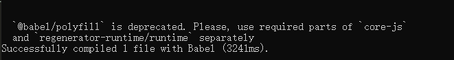
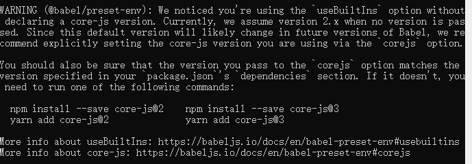
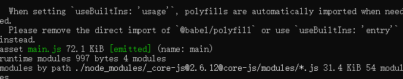
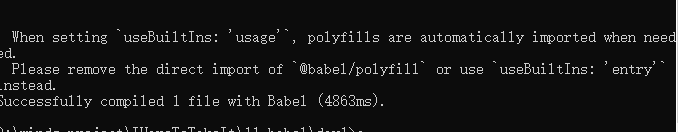
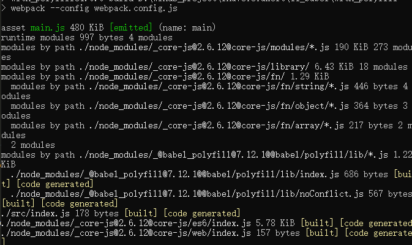
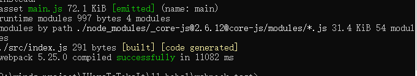

# 不容错过的 Babel7 知识

`侵删`

[原文](https://juejin.cn/post/6844904008679686152#)

[Babel 中文文档](https://www.babeljs.cn/docs/)

Babel 是一个 JS 编译器

Babel 是一个工具链，主要用于将 ES6+ 的代码转换为向后兼容的 JS 语法，以便能够运行在当前和旧版本的浏览器或其他环境中

Babel 能够做什么：

- 语法转换
- 通过 Polyfill 方式在目标环境中添加缺失的特性(@babel/polyfill 模块)
- 源码转换(codemods)

## Babel 使用方法

总共存在三种方式：

- 使用单体文件(standalone script)
- 命令行(cli)
- 构建工具的插件(webpack 的 babel-loader，rollup 的 rollup-plugin-babel)。

**这三种方式都只有入口不同而已，调用的 babel 内核，处理方式都是一样的，所以我们先不纠结入口的问题。**

## 运行方式和插件

babel 总共分为三个阶段：

- 解析
- 转换
- 生成

**babel 本身不具有任何转化功能，他把转化的功能都分解到一个个 plugin 里面。因此当我们不配置任何插件时，经过 babel 的代码和输入是相同的。**

本篇文章的目的是搞明白 Babel 的使用和配置，搞清楚 @babel/runtime，@babel/polyfill，@babel/plugin-transform-runtime 这些作用是什么，插件和预设都是用来干什么的，我们为什么需要配置它们，而不是讲如何进行 AST 转换，如果你对 AST 转换非常感兴趣，欢迎阅读我们的 RN 转小程序引擎 Alita 的源码，其中应用了大量的 AST 转换。

为了更清晰的了解每一步，首先创建一个新项目，例如 babelTemp(你爱取啥名取啥名)，使用 npm init -y 进行初始化，创建 src/index.js，文件内容如下（你也可以随便写点什么）:

```js
const fn = () => {
  console.log('a')
}
```

## @babel/core

Babel 的核心功能包含在 @babel/core 模块中。看到 core 这个词了吧，意味着核心，没有它，在 babel 的世界里注定寸步难行。不安装 @babel/core，无法使用 babel 进行编译。

## CLI 命令行工具 @babel/cli

babel 提供的命令行工具，主要是提供 babel 这个命令，适合安装在项目里。

@babel/node 提供了 babel-node 命令，但是 @babel/node 更适合全局安装，不适合安装在项目里。

将命令配置在 package.json 文件的 scripts 字段中:

```js
//...
"scripts": {
  "compiler": "babel src --out-dir lib --watch"
}
```

使用 cnpm run compiler 来执行编译，现在我们没有配置任何插件，编译前后的代码是完全一样的。

因为 babel 虽然开箱即用，但是什么动作也不做，如果想要 babel 做一些实际的工作，就需要为其添加插件。

## 插件

Babel 构建插件之上，使用现有的或者自己编写的插件可以组成一个转换通道，Babel 的插件分为两种：

- 语法插件
- 转换插件

### 语法插件

这些插件只允许 Babel 解析(parse) 特定类型的语法(不是转换)，可以在 AST 转换时使用，以支持解析新语法，例如：

```js
import * as babel from '@babel/core'
const code = babel.transformFromAstSync(ast, {
  //支持可选链
  plugins: ['@babel/plugin-proposal-optional-chaining'],
  babelrc: false,
}).code
```

### 转换插件

转换插件会启用相应的语法插件(因此不需要同时指定两种插件)，这点很容易理解，如果不启用相应的语法插件，意味着无法解析，连解析都不能解析，又何谈转换呢?

## 插件的使用

如果插件发布在 npm 上，可以直接填写插件的名称，Babel 会自动检查他是否已经被安装在 node_modules 目录下，在项目目录下新建 .babelrc 文件，配置如下：

```json
//.babelrc
{
  // 这里这个插件可以通过插件的名称看出他是专门转换箭头语法的 Babel 插件
  "plugins": ["@babel/plugin-transform-arrow-functions"]
}
```

也可以指定插件的相对/绝对路径

```json
//.babelrc
{
  "plugins": ["./node_modules/@babel/plugin-transform-arrow-functions"]
}
```

执行 npm run compiler，可以看到箭头函数已经被编译 OK， lib/index.js 内容如下:

```js
const fn = function () {
  console.log('a')
}
```

现在，我们仅支持转换箭头函数，如果想将其他的新的 JS 特性转换成低版本，需要使用其他对应的 plugin。如果我们一个一个配置的话，会非常繁琐，因为你可能需要配置几十个插件，这显然非常不便，那么有没有什么办法可以简化这个配置呢?

有!预设!(感谢强大的 Babel)


## 预设

通过使用或创建一个 preset 即可轻松使用一组插件。

### 官方 Preset

- [@babel/preset-env](https://babeljs.io/docs/en/babel-preset-env)
- [@babel/preset-flow](https://babeljs.io/docs/en/babel-preset-flow)
- [@babel/preset-react](https://babeljs.io/docs/en/babel-preset-react)
- [@babel/preset-typescript](https://babeljs.io/docs/en/babel-preset-typescript)

**注：从 Babel v7 开始，所有针对标准提案阶段的功能所编写的预设(stage preset)都已被弃用，官方已经移除了 @babel/preset-stage-x。**

### @babel/preset-env

[babel 原文](https://babeljs.io/docs/en/babel-preset-env)

@babel/preset-env 主要作用是对我们所使用的并且目标浏览器中缺失的功能进行代码转换和加载 polyfill，在不进行任何配置的情况下，@babel/preset-env 所包含的插件将支持所有最新的 JS 特性(es6,es7 等，不包含 stage 阶段)，将其转换为 es5 代码。例如，如果你的代码中使用了可选链(目前，仍在 stage 阶段)，那么只配置 @babel/preset-env，转换时会抛出错误，需要另外安装相应的插件。

```json
//.babelrc
{
  "presets": ["@babel/preset-env"]
}
```

需要说明的是，@babel/preset-env 会根据你配置的目标环境，生成插件列表来编译。对于基于浏览器或 Electron 的项目，官方推荐使用 .browserslistrc 文件来指定目标环境。默认情况下，如果你没有在 Babel 配置文件中(如 .babelrc)设置 targets 或 ignoreBrowserslistConfig，@babel/preset-env 会使用 browserslist 配置源

如果你不是要兼容所有的浏览器和环境，推荐你指定目标环境，这样你的编译代码能够保持最小。

例如，仅包括浏览器市场份额超过 0.25％的用户所需的 polyfill 和代码转换（忽略没有安全更新的浏览器，如 IE10 和 BlackBerry）:

```json
//.browserslistrc
> 0.25%
not dead
```

查看 [browserslist 的更多配置](https://github.com/browserslist/browserslist)

例如，你将 .browserslistrc 的内容配置为:

```json
last 2 Chrome versions
```

然后再执行 npm run compiler，你会发现箭头函数不会被编译成 ES5，因为 chrome 的最新 2 个版本都能够支持箭头函数。现在，我们将 .browserslistrc 仍然换成之前的配置。

就咱们目前的代码来说，当前的配置似乎已经是 OK 的了。


我们修改下 src/index.js

```js
const isHas = [1, 2, 3].includes(2)

const p = new Promise((resolve, reject) => {
  resolve(100)
})
```

编译出来的结果为：

```js
'use strict'

const fn = () => {
  console.log(11)
}

const isHas = [1, 2, 3].includes(2)
const p = new Promise((resolve, reject) => {
  resolve(100)
})
```

这个编译出来的代码在低版本浏览器中使用的话，也是有问题的，因为低版本浏览器中数组实例上并没有 includes 方法，也没有 Promise 构造函数。

这是为什么呢? 因为语法转换只是将高版本的语法转换成低版本的，但是新的内置函数、实例方法无法转换。这时，就需要使用 polyfill 上场了，顾名思义， polyfill 的中文意思是垫片，所谓垫片就是垫平不同浏览器或者不同环境下的差异，让新的内置函数、实例方法等在低版本浏览器中无法使用。


## Polyfill

@babel/polyfill 模块包括 core-js 和一个自定义的 regenerator runtime 模块，可以模拟完整的 ES6+ 环境(不包含第 4 阶段前的提议)，并且打算在应用程序中使用，而不是在库/工具中使用。(使用时，该 polyfill 会自动加载 babel-node)。([babel 原文](https://babeljs.io/docs/en/babel-polyfill))

这意味着可以使用诸如 Promise 和 WeakMap 之类的新的内置组件、Array.from 或 Object.assign 之类的静态方法、Array.prototype.includes 之类的实例方法以及生成器函数(前提是使用了 @babel/plugin-transform-regenerator 插件)。为了添加这些功能，polyfill 将添加到全局范围和类似 String 这样的内置原型中(会对全局环境造成污染，后面我们会介绍不污染全局环境的方法)。

**补充说明(2020/01/07)：从 V7.4.0 版本开始，@babel/ployfill 已经被废弃(前端发展日新月异)，需单独安装 core-js 和 regenerator-runtime 模块，如下警告：**



首先，安装 @babel/polyfill 模块

**注意：不使用 -D，因为这是一个需要在源码之前运行的垫片。**[babel 原文](https://babeljs.io/docs/en/babel-polyfill#installation)

我们需要将完整的 polyfill 在代码之前加载，修改我们的 src/index.js：

```js
// 现在 @babel/polyfill 被废弃，取而代之的是 core-js 和 regenerator-runtime 插件，也不需要 import @babel/polyfill
import '@babel/polyfill'

const isHas = [1, 2, 3].includes(2)

const p = new Promise((resolve, reject) => {
  resolve(100)
})
```

@babel/polyfill 需要在其他代码之前运行，我们也可以在 webpack 中进行配置。

例如：

```js
entry: [require.resolve('./polyfills'), path.resolve('./src/index.js')]
```

polyfills.js 文件内容如下:

```js
//当然，还可能有一些其它的 polyfill，例如 stage 4之前的一些 polyfill
import '@babel/polyfill'
```

现在，我们的代码不管在低版本还是高版本浏览器(或 node 环境)中都能正常运行了。不过，很多时候，我们未必需要完整的 @babel/polyfill，这会导致我们最终构建出的包的体积增大，@babel/polyfill 的包大小为 89K(当前 @babel/polyfill 版本为 7.7.0)。

我们更期望的是，如果我使用了某个新特性，在引入对应的 polyfill，避免引入无用的代码。

值得庆幸的是，Babel 以及考虑到了这一点。


@babel/preset-env 提供了一个 useBuiltIns 参数，设置值为 usage 时，就只会包含代码需要的 polyfill。有一点需要注意：配置此参数的值为 usage，必须要同时设置 corejs(如果不设置，会给出警告，如下图。默认使用的是 corejs2)，注意：这里仍然需要安装 @babel/ployfill（当前 @babel/polyfill 版本会默认安装 corejs2):



而当你设置了 useBuiltIns: usage，则只需要安装 @babel/polyfill 而不需要引入，因为设置了 usage 后自动帮助你做这件事，否则也会报一个警告：



首先说一下使用 core-js@3 的原因，core-js@2 分支中已经不会再添加新特性，新特性都会添加到 core-js@3。例如你使用了 Array.prototype.flat()，如果你使用的是 core-js@2，那么其不包含到此特性。为了可以此特性。为了可以使用更多的新特性，建议大家使用 core-js@3。

安装依赖：

```js
npm install core-js@3 -S
```

[core-js (点击了解更多)](https://github.com/zloirock/core-js) : JavaScript 的模块化标准库，包含 Promise、Symbol、Iterator 和许多其他的特性，它可以让你仅加载必需的功能。

现在，修改 Babel 的配置文件如下：

```js
//.babelrc
const presets = [
  [
    '@babel/env',
    {
      useBuiltIns: 'usage',
      corejs: 3,
    },
  ],
]
```

对于现在的 @babel/polyfill 不再使用 useBuiltIns: usage 选项，当你这样做是，它会提示这样的一个警告：



Babel 会检查所有的代码，以便查找在目标环境中缺失的功能，然后仅仅把需要的 polyfill 包含进来，例如，src/index.js 保持不变：

```js
const isHas = [1, 2, 3].includes(2)

const p = new Promise((resolve, reject) => {
  resolve(100)
})
```

我们看看编译出来的文件(lib/index)：

```js
'use strict'

require('core-js/modules/es.array.includes')

require('core-js/modules/es.object.to-string')

require('core-js/modules/es.promise')

var isHas = [1, 2, 3].includes(2)
var p = new Promise(function (resolve, reject) {
  resolve(100)
})
```

同样的代码，我们用 webpack 构建一下(production 模式)，能看到最终的代码大小仅为：20KB。而如果我们引入整个 @babel/polyfill 的话，构建出的包大小为：89KB

**前面曾提到，在 useBuiltIns 参数值为 usage 时，仍然需要安装 @babel/polyfill(现在 useBuiltIns 的值需要设置 entry)，虽然我们上面的代码转换中看起来并没有使用到，但是，如果我们源码中使用到了 async/await，那么编译出来的代码需要 require("regenerator-runtime/runtime")，在 @babel/polyfill 的依赖中，当然啦，你也可以只安装 regenerator-runtime 取代安装 @babel/polyfill。**

**注意，前面提到像 Chrome 在高版本中对 ES6+ 的新特性已经支持得很好了，所以我们使用了 last chrome versions，这样是正确的，但是就不会出现我们上面使用 @babel/polyfill 编译出来的结果，如果你想要看到它，那么这里需要暂时将 last chrom versions 删掉**

到了这一步，已经很棒棒了，是不是想跳起来转个圈圈？


到这里，我们再来复习一下 @babel/polyfill 的选项以及编译出来的结果：

选项：

[Babel 原文](https://babeljs.io/docs/en/babel-polyfill#usage-in-node--browserify--webpack)

[Babel 原文](https://babeljs.io/docs/en/babel-preset-env#corejs)

- 当与一起使用时@babel/preset-env，

- - 如果 useBuiltIns: 'usage'在中指定，.babelrc 则既不包括@babel/polyfill 在 webpack.config.js 入口数组中，也不包括在源中。注意，@babel/polyfill 仍然需要安装。

when using useBuiltIns: "usage" you have two different alternatives:
set the shippedProposals option to true. This will enable polyfills and transforms for proposal which have already been shipped in browsers for a while.
use corejs: { version: "3.8", proposals: true }. This will enable polyfilling of every proposal supported by core-js@3.8.

- - 如果 useBuiltIns: 'entry'在中指定，.babelrc 则@babel/polyfill 通过 require 或 import 如上所述，将其包含在应用程序入口点的顶部。

  when using useBuiltIns: "entry", you can directly import a proposal polyfill: import "core-js/proposals/string-replace-all".

- - 如果 useBuiltIns 未指定 key 或 useBuiltIns: false 在.babelrc 中明确设置了 key，则@babel/polyfill 直接将其添加到的入口数组中 webpack.config.js，如下：

```js
module.exports = {
  entry: ['@babel/polyfill', './app/js'],
}
```

文件配置及编译结果

- 仅使用 @babel/polyfill 时

```js
// .babelrc
{
  "presets": [
    [
      "@babel/preset-env"
    ]
  ]
}

// index.js
import '@babel/polyfill';

const fn = () => {
  console.log(11);
};

const isHas = [1, 2, 3].includes(2);

const p = new Promise((resolve, reject) => {
  resolve(100);
});
```

编译结果：./with_polyfill/test.js，webpack 打包结果：大小为 480kb，打包文件及其文件位置为：./with_polyfill/main.js



- 使用 useBuiltIns:usage 时，

```js
// .babelrc
{
  "presets": [
    [
      "@babel/preset-env",
      {
        useBuiltIns: "usage"
      }
    ]
  ]
}

// index.js
// import '@babel/polyfill';

const fn = () => {
  console.log(11);
};

const isHas = [1, 2, 3].includes(2);

const p = new Promise((resolve, reject) => {
  resolve(100);
});
```

编译结果：./with_polyfill_useBuiltIns/test.js，webpack 打包结果：大小为 72.1kb，打包文件及其文件位置为：./with_polyfill_useBuiltIns/main.js



下面我要说的内容，也许你已经知道，也许你还不知道，这都不重要，但是此刻起，你要知道了：**Babel 会使用很小的辅助函数来实现类似 \_createClass 等公共方法。默认情况下，它将被添加(inject)到需要他的每个文件中。**

假如，我们的 src/index.js 是这样的：

```js
class Point {
  constructor(x, y) {
    this.x = x
    this.y = y
  }
  getX() {
    return this.x
  }
}

let cp = new ColorPoint(25, 8)
```

编译出来的 lib/index.js，如下所示:

```js
'use strict'

// 如果你没有这一行，可能是你的 .browserslistrc 配置不一致，这里我的配置是空
require('core-js/modules/es.object.define-property.js')

function _classCallCheck(instance, Constructor) {
  if (!(instance instanceof Constructor)) {
    throw new TypeError('Cannot call a class as a function')
  }
}

function _defineProperties(target, props) {
  for (var i = 0; i < props.length; i++) {
    var descriptor = props[i]
    descriptor.enumerable = descriptor.enumerable || false
    descriptor.configurable = true
    if ('value' in descriptor) descriptor.writable = true
    Object.defineProperty(target, descriptor.key, descriptor)
  }
}

function _createClass(Constructor, protoProps, staticProps) {
  if (protoProps) _defineProperties(Constructor.prototype, protoProps)
  if (staticProps) _defineProperties(Constructor, staticProps)
  return Constructor
}

// import '@babel/polyfill';
var Point = /*#__PURE__*/ (function () {
  function Point(x, y) {
    _classCallCheck(this, Point)

    this.x = x
    this.y = y
  }

  _createClass(Point, [
    {
      key: 'getX',
      value: function getX() {
        return this.x
      },
    },
  ])

  return Point
})()

var cp = new ColorPoint(25, 8)
```

看起来，似乎没什么问题，但是你想一下，如果你有 10 个文件中都是用了这个 class，是不是意味着 \_classCallCheck、\_defineProperties、\_createClass 这些方法都被 inject 了 10 次。这显然会导致包体积增大，最关键的是，我们不需要它 inject 多次

这个时候，就是 @babel/plugin-transform-runtime 插件大显身手的时候了，使用 @babel/plugin-transform-runtime 插件，所有帮助程序都将引入模块 @babel/runtime，这样就可以避免编译后的代码中出现重复的帮助程序，有效减少包体积。

## @babel/plugin-transform-runtime

使用@babel/plugin-transform-runtime，并配置参数 corejs: 3。不会污染全局环境。知道这个比较大的原因。是因为 @babel/plugin-transform-runtime 并没有 target 这个配置，他会引入所有浏览器的 polyfill，并且它不会做 tree-shaking。

@babel/plugin-transform-runtime 是一个可以重复使用 Babel 注入的帮助程序，以节省代码大小的插件

**注意：注入 Array.ptototype.flat() 等实例方法将不起作用，因为这需要修改现有的内置函数(可以使用 @babel/polyfill 来解决这个问题)，对比需要说明的是如果你配置的是 corejs3，core-js@3 现在已经支持原型方法，同时不污染原型。**

另外，@babel/plugin-transform-runtime 需要和 @babel/runtime 配合使用。

首先安装依赖，@babel/plugin-transform-runtime 通常仅在开发时使用，但是运行时最终代码需要依赖 @babel/runtime，所以 @babel/runtime 必须要作为生产环境依赖被安装，如下：

```js
npm install --save-dev @babel/plugin-transform-runtime
npm install --save @babel/runtime
```

除了前文所说的，@babel/plugin-transform-runtime 可以减少编译后代码的体积外，我们使用它还有一个好处，他可以为代码创建一个沙盒环境，如果使用 @babel/polyfill 及其提供的内置程序(例如 Promise，Set，和 Map)，则它们将污染全局环境。虽然这对于应用程序或命令行工具可能是可以的，但是如果你的代码是要发布供他人使用的库，或者无法完全控制代码运行的环境，则将称为一个问题。

@babel/plugin-transform-rutime 会将这些内置别名作为 core-js 的别名，因此您可以无缝使用它们，而无需 polyfill。

修改 .babelrc 的配置，如下：

```js
// .babelrc
{
  presets: [
    [
      '@babel/preset-env',
      {
        useBuiltIns: 'usage',
        corejs: 3,
      },
    ],
  ],
  plugins: [
    '@babel/plugin-transform-runtime'
  ]
}
```

重新编译 npm run compiler，现在，编译出来的内容为(lib/index.js)：

```js
'use strict'

var _interopRequireDefault = require('@babel/runtime/helpers/interopRequireDefault')

var _classCallCheck2 = _interopRequireDefault(require('@babel/runtime/helpers/classCallCheck'))

var _createClass2 = _interopRequireDefault(require('@babel/runtime/helpers/createClass'))

var Point = /*#__PURE__*/ (function () {
  function Point(x, y) {
    ;(0, _classCallCheck2['default'])(this, Point)
    this.x = x
    this.y = y
  }

  ;(0, _createClass2['default'])(Point, [
    {
      key: 'getX',
      value: function getX() {
        return this.x
      },
    },
  ])
  return Point
})()

var cp = new ColorPoint(25, 8)
```

可以看出，帮助函数现在不是直接 inject 到代码中，而是从 @babel/runtime 中引入。前文说了使用 @babel/plugin-transform-runtime 可以避免全局污染，我们来看看是如何避免全局污染的。

修改 src/index.js 如下：

```js
let isHas = [1, 2, 3].includes(2)

new Promise((resolve, reject) => {
  resolve(100)
})
```

编译出来的代码如下(lib/index.js)：

```js
'use strict'

require('core-js/modules/es.array.includes.js')

require('core-js/modules/es.promise.js')

require('core-js/modules/es.object.to-string.js')

var isHas = [1, 2, 3].includes(2)
new Promise(function (resolve, reject) {
  resolve(100)
})
```

Array.prototype 上新增了 includes 方法，并且新增了全局的 Promise 方法，污染了全局环境，这跟不使用 @babel/plugin-transform-runtime 没有区别嘛。


如果我们希望 @babel/plugin-transform-runtime 不仅仅处理帮助函数，同时也能加载 polyfill 的话，我们需要给 @babel/plugin-transform-runtime 增加配置信息。

首先新增依赖 @babel/runtime-corejs3：

```js
npm install @babel/runtime-corejs3 -S
```

修改配置文件如下(移除了 @babel/preset-env 的 useBuiltIns 的配置，不然不就重复了嘛嘛嘛，不信的话，你用 async/await 编译下试试咯)：

```js
{
  "presets": [["@babel/preset-env"]],
  "plugins": [
    [
      "@babel/plugin-transform-runtime",
      {
        "corejs": 3
      }
    ]
  ]
}
```

然后重新编译，看一下，编译出来的结果(lib/index.js)：

```js
'use strict'

var _interopRequireDefault = require('@babel/runtime-corejs3/helpers/interopRequireDefault')

var _includes = _interopRequireDefault(require('@babel/runtime-corejs3/core-js-stable/instance/includes'))

var _promise = _interopRequireDefault(require('@babel/runtime-corejs3/core-js-stable/promise'))

var _context

var isHas = (0, _includes['default'])((_context = [1, 2, 3])).call(_context, 2)
new _promise['default'](function (resolve, reject) {
  resolve(100)
})
```

**可以看出，没有直接修改 Array.prototype 或是新增 Promise 方法，避免了全局污染。如果上面 @babel/plugin-transform-runtime 配置的 core-js 是 2，其中不包含实例的 polyfill 需要单独引入。**

**划重点：如果我们配置的 corejs 是 3 版本，那么不管是实例方法还是全局方法，都不会再污染全局环境。**

看到这里，不知道大家有没有这样一个疑问？给 @babel/plugin-transform-runtime 配置 corejs 是如此的完美，既可以将帮主函数编程引用的形式，又可以动态引入 polyfill，并且不会污染全局环境。何必要给 @babel/preset-env 提供 useBuiltIns 功能呢，看起来似乎不需要呀。

待着这样的疑问，我新建了几个文件(内容简单且基本一致，使用了这些新特性)，然后使用 webpack 构建，以下是我对比的数据

| 序号 | .babelrc 配置                                                               | webpack mode production |
| :--- | --------------------------------------------------------------------------- | ----------------------- |
| 0    | 不使用 @babel/plugin-transform-runtime                                      | 36KB                    |
| 1    | 使用@babel/plugin-transform-runtime，并配置参数 corejs: 3。不会污染全局环境 | 37KB                    |
| 2    | 使用@babel/plugin-transform-runtime，不配置 corejs                          | 22KB                    |

我猜测是 @babel/runtime-corejs3/XXX 的包本身比 core-js/modules/XXX 要大一些~

### 插件/预设补充知识

**插件的排列顺序很重要!!!**

如果两个转换插件都将处理"程序(Program)"的某个代码片段，则将根据转换插件或 preset 的排列顺序依次执行。

- 插件在 Presets 前运行。
- 插件顺序从前往后排列。
- Preset 顺序是颠倒的(从后往前)。

例如：

```js
{
  "plugins": ["@babel/plugin-proposal-class-properties", "@babel/plugin-syntax-dynamic-import"]
}
```

先执行 @babel/plugin-proposal-class-properties，后执行 @babel/plugin-syntax-dynamic-import

```js
{
  "presets": ["@babel/preset-env", "@babel/preset-react"]
}
```

preset 的执行顺序是颠倒的，先执行 @babel/preset-react， 后执行 @babel/preset-env。

## 插件顺序

插件和 preset 都可以接受参数，参数由插件名和参数对象组成一个数组。preset 设置参数也是这种格式。

如：

```js
{
  "plugins": [
    [
      "@babel/plugin-proposal-class-properties",
      { "loose": true }
    ]
  ]
}
```

## 插件的短名称

如果插件名称为 @babel/plugin-XXX，可以使用短名称 @babel/XXX：

```js
{
  "plugins": [
    "@babel/transform-arrow-functions" //同 "@babel/plugin-transform-arrow-functions"
  ]
}
```

如果插件名称为 babel-plugin-XXX，可以使用短名称 XXX，该规则同样适用于带有 scope 的插件：

```js
{
  "plugins": [
    "newPlugin", //同 "babel-plugin-newPlugin"
    "@scp/myPlugin" //同 "@scp/babel-plugin-myPlugin"
  ]
}
```

## 插件 Preset

**可以简单的返回一个插件数组**

```js
module.exports = function () {
  return {
    plugins: ['A', 'B', 'C'],
  }
}
```

preset 中也可以包含其他的 preset，以及带有参数的插件。

```js
module.exports = function () {
  return {
    presets: [require('@babel/preset-env')],
    plugins: [[require('@babel/plugin-proposal-class-properties'), { loose: true }], require('@babel/plugin-proposal-object-rest-spread')],
  }
}
```

## 配置文件

Babel 支持多种格式的配置文件。这部分内容补充了解即可，谁管你用哪种配置文件，只要你的配置是 OK 的就可以了(敷衍)~

所有的 Babel API 参数都可以被配置，但是如果该参数需要使用的 JS 代码，那么可能需要使用 JS 代码版的配置文件。

**根据使用场景可以选择不同的配置文件：**

如果希望以编程的方式创建配置文件或者希望编译 node_modules 目录下的模块：那么 babel.config.js 可以满足你的需求。

如果只是需要一个简单的并且中用于单个软件包的配置：那么 .babelrc 即可满足你的需求。

## babel.config.js

在项目根目录下创建一个名为 babel.config.js 的文件。

```js
module.exports = function(api) {
  api.cache(true)

  const presets = [...];
  const plugins = [...];

  return {
    presets,
    plugins
  }
}
```

具体的配置可以查看：[babel.config.js 文档](https://www.babeljs.cn/docs/config-files#project-wide-configuration)

## .babelrc

在项目根目录下创建一个名为 .babelrc 的文件：

```js
{
  presets: [],
  plugins: []
}
```

具体的配置可以参考 [.babelrc 文档](https://www.babeljs.cn/docs/config-files#file-relative-configuration)

## package.json

可以将 .babelrc 中的配置信息作为 babel 键(key) 添加到 package.json 文件中：

```js
{
  "name": "my-package",
  "babel": {
    "presets": [],
    "plugins": []
  }
}
```

## .babelrc.js

与 .babelrc 配置相同，但是可以使用 JS 编写。

```js
//可以在其中调用 Node.js 的 API
const presets = []
const plugins = []

module.exports = { presets, plugins }
```


# babel 7 的使用的个人理解

`侵删`

[原文](https://www.jianshu.com/p/cbd48919a0cc)

要使用各种真正的编译功能是需要配合各种插件的，要将箭头函数编译成普通函数需要使用 [@babel/plugin-transform-arrow-functions](https://babeljs.io/docs/en/babel-plugin-transform-arrow-functions)，要将 const 或者 let 变量编译成 var 变量需要[@babel/plugin-transform-block-scoping](https://babeljs.io/docs/en/babel-plugin-transform-block-scoping)，要将 class 关键字转化成传统基于原型的类需要[@babel/plugin-transform-classes](https://babeljs.io/docs/en/babel-plugin-transform-classes)，所以为了真正的编译我们是可能需要大量各种的插件的，具体插件有哪些请点[这里](https://babeljs.io/docs/en/plugins)

# babel corejs@3 是如何按需 polyfill 原型对象方法的

`侵删`

[原文](https://zhuanlan.zhihu.com/p/139359864)

最近组内小伙伴升级了项目的 babel，研究了各种配置后，总结出了两种配置方案

方案一：使用 preset-env + corejs@3

```js
{
  "presets": [
    [
      "@babel/preset-env",
      {
        "useBuiltIns": "usage",
        "corejs": 3
      }
    ]
  ]
}
```

方案二：使用@babel/plugin-transform-runtime + corejs@3

```js
{
  "presets": [
    [
      "@babel/preset-env"
    ]
  ],
  "plugins": [
    ["@babel/plugin-transform-runtime", {
      "corejs": 3
    }]
  ]
}
```

他们的区别在于方案一实际使用的是 core-js，采用修改全局对象的方式去 polyfill。方案二使用的是 core-js-pure，采用不污染全局对象模式去 polyfill。

不过最让我惊讶的是，corejs 怎么就能 polyfill 原型上的方法了。

在以前的认知里面

babel 的各种 presets => 转义语法

babel-polyfill => 污染全局对象的形式，引入全部的 polyfill，去兼容所有 API 和原型方法

babel-plugin-transform-runtime => 不污染全局对象的形式，按需去 polyfill API，但不能 polyfill 原型方法。这个也很好理解，比如下面的代码

```js
const a = (function () {
  return [1, 2, 3]
})()

a.includes(3)
```

通过代码静态分析，是不可能知道 a 是什么类型的，也就无法引入 Array.prototype.includes；

那配置了 corejs: 3 后，为什么就可以了呢？思前想后，感觉有点不可思议，就去网上查资料，终于知道原理了。

自己陷入了一个思维误区，如果一直去想如何分析出 a 的类型，那么是无解的。但是，换个思路，polyfill 上面的代码，一定要需要知道 a 的类型吗。

.includes 方法，只有 Array 和 String 存在。所以，同时引入 Array.prototype.includes 和 String.prototype.includes 的 polyfill，其实就可以了呢。方案一种的配置就是这么做的，上述代码用方案一转义后，就变成了

```js
'use strict'

require('core-js/modules/es.array.includes')

require('core-js/modules/es.string.includes')

var a = (function () {
  return [1, 2, 3]
})()

a.includes(3)
```

那如果不污染全局对象呢，其实也差不多，在 polyfill 的时候，可以判断下，调用 includes 的对象是什么类型，如果是 String，就用 String 的 polyfill，如果是 Array，就用 Array 的 polyfill。上面的代码用方案二编译后结果是

```js
'use strict'

var _interopRequireDefault = require('@babel/runtime-corejs3/helpers/interopRequireDefault')

var _includes = _interopRequireDefault(require('@babel/runtime-corejs3/core-js-stable/instance/includes'))

var a = (function () {
  return [1, 2, 3]
})()

;(0, _includes['default'])(a).call(a, 3)
```

[参考资料](https://link.zhihu.com/?target=https%3A//github.com/babel/babel/issues/8928)

# core-js@3 带来的惊喜

`侵删`

[原文](https://www.cnblogs.com/sefaultment/p/11631314.html)

corejs 这个名词肯定很多人没听过，今天也是在配置 babelpolyfill 方法发现的

起因：


在使用 useBuiltIns:usage 按需加载 polyfill 时，npm run build，就出现上述的提示

```js
{
  "presets": [
    ["@babel/preset-env", {
      "useBuiltIns": "usage",
      "targets": {
        "chrome": "58",
        "ie": "11"
      }
    }]
  ]
}
```

大意是说我们使用了 useBuiltIns 选项但是没有指定 core-js 警告，但是告诉你默认是使用 core-js@2，但是这个默认行为以后可能会发生改变，最好显示设置 core.js，然后列出了@2 和@3 两个版本

## core-js 介绍

其实 core-js 是我们能够使用新的 API 的最重要的包，然而一般情况它隐藏在 webpack 编译后的代码中，我们一般不会去查看，所以容易被遗忘，我们在 webpack 生成环境下，查看编译后的代码，可以看到例如 includes 就是从 core-js 导出到我们的代码去的


### core-js 是什么

- 它是 JS 标准库的 polyfill
- 它尽可能的进行模块化，让你能选择你需要的功能
- 它可以不污染全局空间
- 它和 babel 高度集成，可以对 core-js 的引入进行最大程度的优化

## 升级 core-js@3 动机

目前我们使用的都默认是 core-js@2，他在一年半(文中)之前就封锁了分支，到此之后的特性都只会添加到 core-js@3，这里有一个生产例子，使用了 core-js@2 不支持的新特性，导致错误

core-js@2 出现的问题

[Vue-cli 使用 flat 报错](https://juejin.im/post/5d7efbbb6fb9a06b2650c74a)

vue-cli 也会在 V4 升级 core-js

[Roadmap for Vue-cli4](https://github.com/vuejs/vue-cli/issues/3649)

core-js@3 添加的特性

[具体 core-js@3 才有的特性看这里](https://github.com/zloirock/core-js/blob/master/docs/2019-03-19-core-js-3-babel-and-a-look-into-the-future.md#babelpreset-env)

## core-js@3 特性概览

- 支持 ECMAScript 稳定功能，引入 core-js@3 冻结期间的新功能，比如 flat
- 加入到 Ees6-es9 中的提案，现在已经被标记为稳定功能
- **更新了对提案的实现，增加了 proposals 配置项，由于提案阶段不稳定，需要谨慎使用**
- **增加了对一些 web 标准的支持，比如 URL 和 URLSearchParams**
- **现在支持原型方法，同时不污染原型**
- 删除了过时的特性

## core-js@3 与 babel

以前我们实现 API 的时候，会引入整个 polyfill，其实 polyfill 就只包含以下两个包

- core-js
- regenerator-runtime

## core-js@3 升级之后弃用了 @babel/polyfill，以下是等价实现

```js
// babel.config.js
presets: [
  [
    '@babel/preset-env',
    {
      useBuiltIns: 'entry', // or "usage"
      corejs: 3,
    },
  ],
]

import 'core-js/stable'
import 'regenerator-runtime/runtime'
```

## 总结

core-js@3 废弃了 babel-polyfill，实现了完全无污染的 API 转译，非常有潜力，但是其暂时会增加打包体积，这个还得看未来普及度上来之后的权衡。

# 不要肆无忌惮地在你的项目中使用 ES78910 了～

`侵删`

[原文](https://juejin.cn/post/6844903942451642376)

# Babel 用户手册

[原文](https://github.com/jamiebuilds/babel-handbook/blob/master/translations/zh-Hans/user-handbook.md)

## babel-register

下一个常用的运行 Babel 的方法是通过 babel-register。这种方法只需要引入文件就可以运行 Babel，或许就能更好的融入你的项目设置。

但请注意这种方法并不适合正式产品环境使用。直接部署用此方式编译的代码不是好的做法。在部署之前预先编译会更好。不过用在构建脚本或是其他运行的脚本中是非常合适的。

让我们先在项目中创建 index.js 文件。

```js
console.log('Hello world!')
```

如果我们用 node index.js 来运行它是不会使用 Babel 来编译的。所以我们需要 babel-register。

首先安装 babel-register。

```js
npm install babel-register -D
```

接着，在项目中创建 register.js 文件并添加如下代码：

```js
require('babel-register')
require('./index.js')
```

这样做可以把 Babel 注册到 Node 的模块系统中并开始编译其中的 require 的所有文件。

先在我们可以使用 register.js 来代替 node index.js 运行了。

```js
node register.js
```

**注意：你不能在你要编译的文件内同时注册 Babel，因为 node 会在 Babel 编译它之前就将它执行了。**

## babel-preset-es2015

我们先从让 Babel 把 ES2015（最新版本的 JavaScript 标准，也叫做 ES6）编译成 ES5（现今在大多数 JavaScript 环境下可用的版本）开始吧。

我们需要安装 "es2015" Babel 预设：

```js
npm install --save-dev babel-preset-es2015
```

我们修改 .babelrc 来包含这个预设。

```js
{
  "presets": ["es2015"]
}
```

## babel-preset-stage-x

JavaScript 还有一些提案，正在积极通过 TC39（ECMAScript 标准背后的技术委员会）的流程成为标准的一部分。

这个流程分为 5（0－4）个阶段。 随着提案得到越多的关注就越有可能被标准采纳，于是他们就继续通过各个阶段，最终在阶段 4 被标准正式采纳。

以下是 4 个不同阶段的（打包的）预设：

- babel-preset-stage-0
- babel-preset-stage-1
- babel-preset-stage-2
- babel-preset-stage-3

**注意 stage-4 预设是不存在的因为它就是上面的 es2015 预设。**

以上每种预设都依赖于紧随的后期阶段预设。例如，babel-preset-stage-1 依赖 babel-preset-stage-2，后者又依赖 babel-preset-stage-3。.

使用的时候只需要安装你想要的阶段就可以了：

```js
npm install --save-dev babel-preset-stage-2
```

```js
{
  "presets": [
    "es2015",
    "react",
    "stage-2"
  ],
  "plugins": []
}
```

# Babel 插件手册

[Babel handbook](https://github.com/jamiebuilds/babel-handbook/blob/master/translations/zh-Hans/plugin-handbook.md)

## 介绍

Babel 是一个通用的多功能的 JavaScript 编译器。此外它还拥有众多模块可用于不同形式的静态分析。

> 静态分析是在不需要执行代码的前提下对代码进行分析的处理过程(执行代码的同时进行代码分析即是动态分析)。静态分析得人目的是多种多样的，它可用于语法检查、编译、代码高亮、代码转换、优化、压缩等等场景。

你可以使用 Babel 创建多种类型的工具来帮助你更有效率并且写出更好的程序。

## 基础

Babel 是 JavaScript 编译器，更确切地说是源码到源码的编译器，通常也叫做"转换编译器(transpiler)"。意思是说你为 Babel 提供一些 JavaScript 代码，Babel 更改这些代码，然后返回给你新生成的代码。

### 抽象语法树 Abstract Syntax Tree

这个处理过程中的每一步都设计到创建或是操作[抽象语法树](https://en.wikipedia.org/wiki/Abstract_syntax_tree)，亦称 AST。

> Babel 使用一个基于 [ESTree](https://github.com/estree/estree) 并修改过的 AST，它的内核说明文档可以在[这里](https://github.com/babel/babel/blob/master/doc/ast/spec.md)找到。

```js
function square(n) {
  return n * n
}
```

> [AST Explorer](http://astexplorer.net/)可以让你对 AST 节点有一个更好的感性认识。[这里](http://astexplorer.net/#/Z1exs6BWMq)是上述代码的一个示例链接。

这个程序可以被表示为如下的一棵树：

```js
- FunctionDeclaration:
  - id:
    - Identifier:
      - name: square
  - params [1]
    - Identifier
      - name: n
  - body:
    - BlockStatement
      - body [1]
        - ReturnStatement
          - argument
            - BinaryExpression
              - operator: *
              - left
                - Identifier
                  - name: n
              - right
                - Identifier
                  - name: n
```

或是如下所示的 JavaScript Object：

```js
{
  type: "FunctionDeclaration",
  id: {
    type: "Identifier",
    name: "square"
  },
  params: [{
    type: "Identifier",
    name: "n"
  }],
  body: {
    type: "BlockStatement",
    body: [{
      type: "ReturnStatement",
      argument: {
        type: "BinaryExpression",
        operator: "*",
        left: {
          type: "Identifier",
          name: "n"
        },
        right: {
          type: "Identifier",
          name: "n"
        }
      }
    }]
  }
}
```

你会留意到 AST 的每一层都有相同的结构：

```js
{
  type: "FunctionDeclaration",
  id: {...},
  params: [...],
  body: {...}
}
```

```js
{
  type: "Identifier",
  name: ...
}
```

```js
{
  type: "BinaryyExpression",
  operator: ...,
  left: {...},
  right: {...}
}
```

这样的每一层结构也被叫做**节点(Node)**。一个 AST 可以由单一的节点或是成百上千哥节点构成。他们组合在一起可以描述用于静态分析的程序语法。

每一个节点都有如下所示的接口(Interface)：

```
interface Node {
  type: Stringh;
}
```

字符串形式的 type 字段表示节点的类型(如："FunctionDeclaration"，"Identifier"，或 "BinaryExpression")。每一种类型的节点定义了一些附加属性用来进一步描述该节点类型。

Babel 还为每个节点额外生成了一些属性，用于描述该节点在原始代码中的位置。

```js
{
  type: ...,
  start: 0,
  end: 38,
  loc: {
    start: {
      line: 1,
      column: 0
    },
    end: {
      line: 3,
      column: 1
    }
  }
}
```

每一个节点都会有 start，end，loc 这几个属性。

### Babel 的处理步骤

Babel 的三个主要处理步骤分别是：**解析 parse**，**转换 transform**，**生成 generate**。

#### 解析

解析步骤接受代码并输出 AST。这个步骤分为两个阶段：**词法分析 Lexical Analysis**，**语法分析 Syntactic Analysis**。

##### 词法分析

词法分析阶段把字符串形式的代码转换为 tokens 流。

你可以把 tokens 看作是一个扁平的语法片段数组：

```js
n * n
```

```js
[
  { type: {...}, value: 'n', start: 0, end: 1, loc: {...} },
  { type: {...}, value: '*', start: 2, end: 3, loc: {...} },
  { type: {...}, value: 'n', start: 4, end: 5, loc: {...} },
  ...
]
```

每一个 type 有一组属性来描述该 token：

```js
{
  type: {
    label: 'name',
    keyword: undefined,
    beforeExpr: false,
    startsExpr: true,
    rightAssociative: false,
    isLoop: false,
    isAssign: false,
    prefix: false,
    postfix: false,
    binop: null,
    updateContext: null
  },
  ...
}
```

和 AST 节点一样它们也有 start，end，loc 属性。

##### 语法分析

语法分析阶段会把一个 token 流转换成 AST 的形式。这个阶段会使用令牌中的信息把它们转换成一个 AST 的表述结构，这样更易于后续的操作。

#### 转换

[转换](https://en.wikipedia.org/wiki/Program_transformation)步骤接收 AST 并对其进行遍历，在此过程中对节点进行添加、更新以及移除等操作。这是 Babel 或是其他编译器中最复杂的过程，同时也是插件将要介入工作的部分，这将是本手册的主要内容，因此让我们慢慢来。

#### 生成

[代码生成](<https://en.wikipedia.org/wiki/Code_generation_(compiler)>)步骤把最终(经过一系列转换之后)的 AST 转换成字符串形式的代码，同时还会创建 [源码映射(source maps)](http://www.html5rocks.com/en/tutorials/developertools/sourcemaps/)

**代码生成其实很简单：深度优先遍历整个 AST，然后呢构建可以表示转换后代码的字符串。**

### 遍历

想要转换 AST 你需要进行递归的[树形遍历](https://en.wikipedia.org/wiki/Tree_traversal)。

比方说我们有一个 FunctionDeclaration 类型。它有几个属性：id，params 和 body，每一个都有一些内嵌节点。

```js
{
  type: "FunctionDeclaration",
  id: {
    type: "Identifier",
    name: "square"
  },
  params: [{
    type: "Identifier",
    name: "n"
  }],
  body: {
    type: "BlockStatement",
    body: [{
      type: "ReturnStatement",
      argument: {
        type: "BinaryExpression",
        operator: "*",
        left: {
          type: "Identifier",
          name: "n"
        },
        right: {
          type: "Identifier",
          name: "n"
        }
      }
    }]
  }
}
```

于是我们从 FunctionDeclaration 开始并且我们知道它的内部属性(即 id，params，body)，所以我们依次访问每一个属性及它们的子节点。

接着我们来到 id，它是一个 Identifier。IdentIfier 没有任何子节点属性，所以我们继续。

之后是 params，由于它是一个数组节点所以我们访问其中的每一个，它们都是 Identifier 类型的单一节点，然后我们继续

此时我们来到了 body，这是一个 BlockStatement 并且也有一个 body 节点，而且也是一个数组节点，我们继续访问其中的每一个。

这里唯一的一个属性是 ReturnStatement 节点，它有一个 argument，我们访问 argument 就找到了 BinaryExpression。

BinaryExpression 有一个 operator，一个 left，和一个 right。 Operator 不是一个节点，它只是一个值因此我们不用继续向内遍历，我们只需要访问 left 和 right。

Babel 的转换步骤全都是这样的遍历过程。

### Visitors(访问者)

当我们谈及"进入"一个节点，实际上是说我们在**访问**它们，之所以使用这样的术语是因为有一个[访问者模式(visitor)](https://en.wikipedia.org/wiki/Visitor_pattern)的概念。

访问者是一个用于 AST 遍历的跨语言的模式。简单的说它们就是一个对象，定义了用于在一个树状结构中获取具体节点的方法。这么说有些抽象所以让我们来看一个例子。

```js
const MyVisitor = {
  Identifier() {
    console.log('Called!')
  },
}

// 你也可以先创建一个访问者对象，并在稍后给它添加方法。
let visitor = {}
visitor.MemberExpression = function () {}
visitor.FunctionDeclaration = function () {}
```

> 注意：Identifier(){} 是 Identifier{ enter() {} } 的简写形式。

**这是一个简单的访问者，把它用于遍历中时，每当在树中遇见一个 Identifier 的时候会调用 Identifier() 方法。**

所以在下面的代码中 Identifier() 方法会被调用四次(包括 square 在内，总共有四个 Idenfifier)

```js
function square(n) {
  return n * n
}
```

```js
path.traverse(MyVisitor);
Called!
Called!
Called!
Called!
```

这些调用都发生在**进入**节点时，不过有时候我们也可以在**退出**时调用访问者方法。

假设我们有一个树状结构：

```js
;-FunctionDeclaration - Identifier(id) - Identifier(params[0]) - BlockStatement(body) - ReturnStatement(body) - BinaryExpression(argument) - Identifier(left) - Identifier(right)
```

当我们向下遍历这棵树的每一个分支时我们最终会走到尽头，于是我们需要往上遍历回去从而获取下一个节点。向下遍历这棵树我们**进入**每个节点，向上遍历回去时我们**退出**每个节点。

让我们以上面那棵树为例子走一遍这个过程。

进入 FunctionDeclaration
进入 Identifier (id)
走到尽头
退出 Identifier (id)
进入 Identifier (params[0])
走到尽头
退出 Identifier (params[0])
进入 BlockStatement (body)
进入 ReturnStatement (body)
进入 BinaryExpression (argument)
进入 Identifier (left)
走到尽头
退出 Identifier (left)
进入 Identifier (right)
走到尽头
退出 Identifier (right)
退出 BinaryExpression (argument)
退出 ReturnStatement (body)
退出 BlockStatement (body)
退出 FunctionDeclaration

所以当创建访问者时你实际上有两次机会来访问一个节点。

```js
const MyVisitor = {
  Identifier: {
    enter() {
      console.log('Entered!')
    },
    exit() {
      console.log('Exited!')
    },
  },
}
```

**如有必要，你还可以把方法名用 | 分割成 Identifier | MemberExpression 形式的字符串，把同一个函数应用到多种访问节点。**

在 [flow-comments](https://github.com/babel/babel/blob/2b6ff53459d97218b0cf16f8a51c14a165db1fd2/packages/babel-plugin-transform-flow-comments/src/index.js#L47) 插件中的例子如下：

```js
const MyVisitor = {
  'ExportNameDeclaration|Flow'(path) {},
}
```

你也可以在访问者中使用别名(如 [babel-types](https://github.com/babel/babel/tree/master/packages/babel-types/src/definitions))。

例如：

Function 是 FunctionDeclaration，FunctionExpression，ArrowFunctionExpression，ObjectMethod，ObjectMethod 和 ClassMethod 的别名。

```js
const MyVisitor = {
  Function(Path) {},
}
```

## Paths 路径

AST 通常会有许多节点，那么节点之间如何相互关联呢？我们可以使用一个可操作和访问的巨大可变对象表示节点之间的关联关系，或者也可以用 Paths(路径) 来简化这件事情。

**Path 是表示两个节点之间连接的对象**

例如，如果有下面这样一个节点及其子节点：

```js
{
  type: "FunctionDeclaration",
  id: {
    type: "Identifier",
    name: "square"
  }
}
```

将子节点 Identifier 表示为一个路径 Path 的话，看起来是这样的：

```js
{
  parent: {
    type: "FunctionDeclaration",
    id: {...},
    ...
  },
  node: {
    type: "Identifier",
    name: "square"
  }
}
```

同时它还包含关于该路径的其他元数据：

```json
{
  "parent": {...},
  "node": {...},
  "hub": {...},
  "contexts": [],
  "data": {},
  "shouldSkip": false,
  "shouldStop": false,
  "removed": false,
  "state": null,
  "opts": null,
  "skipKeys": null,
  "parentPath": null,
  "context": null,
  "container": null,
  "listKey": null,
  "inList": false,
  "parentKey": null,
  "key": null,
  "scope": null,
  "type": null,
  "typeAnnotation": null
}
```

当然路径对象还包含添加、更新、移动和删除节点有关的其他很多方法，稍后我们再来看这些方法。

**在某种意义上，路径是一个节点在树中的位置以及关于该节点各种信息的响应式 Reactive 表示。当你调用一个修改树的方法后，路径信息也会被更新。Babel 帮你管理这一切，从而使得节点操作简单，尽可能做到无状态。**

### Paths in Visitor(存在于访问者中的路径)

当你有一个 Identifier() 成员方法的访问者时，你实际上是在访问路径而非节点。通过这种方式，你操作的就是节点的响应式表示(译注：即路径)而非节点本身。

```js
const MyVisitor = {
  Identifier(path) {
    console.log('Visiting: ' + path.node.name)
  },
}

a + b + c

path.traverse(MyVisitor)

// result:

Visiting: a
Visiting: b
Visiting: c
```

## State 状态

**状态是抽象语法树 AST 转换的敌人，状态管理会不断牵扯你的精力，而且几乎所有你对状态的假设，总是会有一些未考虑到的语法证明你的假设是错误的。**

考虑如下代码：

```js
function square(n) {
  return n * n
}
```

让我们写一个把 n 重命名为 x 的访问者的快速实现。

```js
let paramName

const MyVisitor = {
  FunctionDeclaration(path) {
    const param = path.node.params[0]
    paramName = param.name
    param.name = 'x'
  },
  Identifier(path) {
    if (path.node.name === paramName) {
      path.node.name = 'x'
    }
  },
}
```

对上面的例子代码这段访问者代码也许能工作，但它很容易被打破：

```js
function square(n) {
  return n * n
}

n
```

更好的处理方式是使用递归，一个访问者放进另一个访问者里面：

```js
const updateParamNameVisitor = {
  Identifier(path) {
    if (path.node.name === this.paramName) {
      path.node.name = 'x'
    }
  },
}

const MyVisitor = {
  FunctionDeclaration(path) {
    const param = path.node.params[0]
    const paramName = param.name
    param.name = 'x'

    path.traverse(updateParamNameVisitor, { paramName })
  },
}

path.traverse(MyVisitor)
```

当然，这只是一个可以刻意编写的例子，不过它演示了如何从访问者中消除全局状态。

## Scope 作用域

接下来让我们介绍[作用域 scope](<https://en.wikipedia.org/wiki/Scope_(computer_science)>)的概念。JavaScript 支持[词法作用域](<https://en.wikipedia.org/wiki/Scope_(computer_science)#Lexical_scoping_vs._dynamic_scoping>)，在树状嵌套中代码块创建出新的作用域。

```js
// global scope

function scopeOne() {
  // scope 1

  function scopeTwo() {
    // scope 2
  }
}
```

在 JavaScript 中，每当你创建了一个引用，不管是通过变量 variable、函数 function、类 class、参数 params、模块导入 import 还是标签 label 等，它都属于当前作用域。

```js
var global = 'I am in the global scope'

function scopeOne() {
  var one = 'I am in the scope created by `scopeOne()`'

  function scopeTwo() {
    var two = 'I am in the scope created by `scopeTwo()`'
  }
}
```

更深的内部作用域代码可以使用外层作用域中的引用。

```js
function scopeOne() {
  var one = 'I am in the scope created by `scopeOne()`'

  function scopeTwo() {
    one = 'I am updating the reference in `scopeOne` inside `scopeTwo`'
  }
}
```

内层作用域也可以创建和外层作用域同名的引用。

```js
function scopeOne() {
  var one = 'I am in the scope created by `scopeOne()`'

  function scopeTwo() {
    var one = 'I am creating a new `one` but leaving reference in `scopeOne()` alone.'
  }
}
```

当编写一个转换时，必须小心作用域。我们得确保在改变代码的各个部分时不会破坏已经存在的代码。

我们在添加一个新的引用时需要确保新增加的引用名字和已有的所有引用不冲突。 或者我们仅仅想找出使用一个变量的所有引用， 我们只想在给定的作用域（Scope）中找出这些引用。

作用域可以被表示为如下形式：

```js
{
  path: path,
  block: path.node,
  parentBlock: path.parent,
  parent: parentScope,
  bindings: [...]
}
```

**当你创建一个新的作用域时，需要给出它的路径和父作用域，之后在遍历过程中它会在该作用域内收集所有的引用("绑定")。**

一旦引用收集完毕，你就可以在作用域（Scopes）上使用各种方法，稍后我们会了解这些方法。

## Bindings 绑定

所有引用属于特定的作用域，引用和作用域的这种关系被称作：绑定 binding

```js
function scopeOne() {
  var ref = 'This is a binding'
}

ref // This is a reference to a binding

function scopeTwo() {
  ref // This is a reference to a binding from a lower scope
}
```

单个绑定看起来像这样︰

```js
Text for Translation
{
  identifier: node,
  scope: scope,
  path: path,
  kind: 'var',

  referenced: true,
  references: 3,
  referencePaths: [path, path, path],

  constant: false,
  constantViolations: [path]
}
```

**有了这些信息你就可以查找一个绑定的所有引用，并且知道这是什么类型的绑定(参数，定义等等)，查找它所属的作用域，或者拷贝它的标识符。你甚至可以知道它是不是常量，如果不是，那么是哪个路径修改了它。**

**在很多情况下，知道一个绑定是否是常量非常有用，最有用的一种情形就是代码压缩时。**

```js
function scopeOne() {
  var ref1 = 'This is a constant binding'

  becauseNothingEverChangesTheValueOf(ref1)

  function scopeTwo() {
    var ref2 = 'This is *not* a constant binding'
    ref2 = 'Because this changes the value'
  }
}
```

## API

**Babel 实际上是一组模块的集合。**

> 注意：本节内容不是详细的 API 文档的替代品，正式的 API 文档将很快提供出来。

### babel-parser

Babel Parser 是 Babel 的解析器。最初是从 Acorn 项目 fork 出来的。Acorn 非常快，易于使用，并且针对非标准特性(以及那些未来的标准特性) 设计了一个基于插件的架构。

先从解析一个代码字符串开始：

```js
import parser from '@babel/parser'

const code = `function square(n) {
  return n * n;
}`

parser.parse(code)
// Node {
//   type: "File",
//   start: 0,
//   end: 38,
//   loc: SourceLocation {...},
//   program: Node {...},
//   comments: [],
//   tokens: [...]
// }
```

我们还能像下面这样传递选项给 parse()方法：

```js
parser.parse(code, {
  sourceType: 'module', // default: "script"
  plugins: ['jsx'], // default: []
})
```

sourceType 可以是 "module" 或者 "script"，它表示 Babel Parser 应该用哪种模式来解析。 "module" 将会在严格模式下解析并且允许模块定义，"script" 则不会。

> 注意： sourceType 的默认值是 "script" 并且在发现 import 或 export 时产生错误。 使用 scourceType: "module" 来避免这些错误。

由于 Babel Parser 使用了基于插件的架构，因此有一个 plugins 选项可以开关内置的插件。 注意 Babel Parser 尚未对外部插件开放此 API 接口，不排除未来会开放此 API。

要查看完整的插件列表，请参见 [Babel parser docs](https://babeljs.io/docs/en/babel-parser#plugins)。

### babel-traverse

**Babel Traverse（遍历）模块维护了整棵树的状态，并且负责替换、移除和添加节点。**

我们可以和 Babel Parser 一起使用来遍历和更新节点：

```js
import parser from '@babel/parser'
import traverse from '@babel/traverse'

const code = `function square(n) {
  return n * n;
}`

const ast = parser.parse(code)

traverse(ast, {
  enter(path) {
    if (path.node.type === 'Identifier' && path.node.name === 'n') {
      path.node.name = 'x'
    }
  },
})
```

### babel-types

Babel Types 模块是一个用于 AST 节点的 Lodash 式工具库（译注：Lodash 是一个 JavaScript 函数工具库，提供了基于函数式编程风格的众多工具函数）， 它包含了构造、验证以及变换 AST 节点的方法。该工具库包含考虑周到的工具方法，对编写处理 AST 逻辑非常有用。

```js
import traverse from '@babel/traverse'
import * as t from '@babel/types'

traverse(ast, {
  enter(path) {
    if (t.isIdentifier(path.node, { name: 'n' })) {
      path.node.name = 'x'
    }
  },
})
```

### Definitions 定义

**Babel Types 模块拥有每一个单一类型节点的定义，包括节点包含哪些属性，什么是合法值，如何构建节点、遍历节点，以及节点的别名等信息。**

单一节点类型的定义形式如下：单一节点类型的定义形式如下：

```js
defineType('BinaryExpression', {
  builder: ['operator', 'left', 'right'],
  fields: {
    operator: {
      validate: assertValueType('string'),
    },
    left: {
      validate: assertNodeType('Expression'),
    },
    right: {
      validate: assertNodeType('Expression'),
    },
  },
  visitor: ['left', 'right'],
  aliases: ['Binary', 'Expression'],
})
```

### Builders 构建器

你会注意到上面的 BinaryExpression 定义有一个 builder 字段。

```js
builder: ['operator', 'left', 'right']
```

这时有每一个节点类型都有构造器方法 builder，按类似下面的方式使用：

```js
t.binaryExpression('*', t.identifier('a'), t.identifier('b'))
```

可以创建如下所示的 AST：

```js
{
  type: "BinaryExpression",
  operator: "*",
  left: {
    type: "Identifier",
    name: "a"
  },
  right: {
    type: "Identifier",
    name: "b"
  }
}
```

当打印出来之后是这样的：

```js
a * b
```

构造器还会验证自身创建的节点，并在错误使用的情形下会抛出描述性错误，这就引出了下一个方法类型

### Validators 验证器

BinaryExpression 的定义还包含了节点的字段 fields 信息，以及如何验证这些字段。

```js
fields: {
  operator: {
    validate: assertValueType("string")
  },
  left: {
    validate: assertNodeType("Expression")
  },
  right: {
    validate: assertNodeType("Expression")
  }
}
```

可以创建两种验证方法。第一种是 isX。

```js
t.isBinaryExpression(maybeBinaryExpressionNode)
```

这个测试用来确保节点是一个二元表达式，另外你也可以传入第二个参数来确保节点包含特定的属性和值。

```js
t.isBinaryExpression(maybeBinaryExpressionNode, { operator: '*' })
```

这些方法还有一种断言式的版本，会抛出异常而不是返回 true 或 false。

```js
t.assertBinaryExpression(maybeBinaryExpressionNode)
t.assertBinaryExpression(maybeBinaryExpressionNode, { operator: '*' })
```

### Converters 变换器

#### babel-generator

Babel Generator 模块是 Babel 的代码生成器，它读取 AST 并将其转换为代码和源码映射(sourcemaps)

```js
import parser from '@babel/parser'
import generate from '@babel/generator'

const code = `function square(n) {
  return n * n;
}`

const ast = parser.parse(code)

generate(ast, {}, code)
// {
//   code: "...",
//   map: "..."
// }
```

你也可以给 generate() 方法传递选项。

```js
generate(
  ast,
  {
    retainLines: false,
    compact: 'auto',
    concise: false,
    quotes: 'double',
    // ...
  },
  code,
)
```

#### babel-template

babel-template 是另一个虽然很小但却非常有用的模块。它能让你编写字符串形式且带有占位符的代码来代替手动编码，尤其是生成的大规模 AST 的时候。在计算机科学中，这种功能被称为准引用 quasiquotes。

```js
import template from '@babel/template'
import generate from '@babel/generator'
import * as t from '@babel/types'

const buildRequire = template(`
  var IMPORT_NAME = require(SOURCE);
`)

const ast = buildRequire({
  IMPORT_NAME: t.identifier('myModule'),
  SOURCE: t.stringLiteral('my-module'),
})

generate(ast)
/* 
{
  code: 'var myModule = require(my-module);',
  map: null,
  rawMappings: undefined
}
*/
```

## Writing your first Babel Plugin

现在你已经熟悉了 Babel 的所有基础知识了，让我们把这些知识和插件的 API 融合在一起来编写第一个 Babel 插件吧。

先从一个接收了当前 babel 对象作为参数的 [function](https://github.com/babel/babel/tree/master/packages/babel-core) 开始。

```js
export default function (babel) {
  // plugin contents
}
```

由于你将会经常这样使用，所以直接取出 babel.types 会更方便：（译注：这是 ES2015 语法中的对象解构，即 Destructuring）

```js
export default function ({ types: t }) {
  // plugin contents
}
```

接着返回一个对象，其 visitor 属性是这个插件的主要访问者。

```js
export default function ({ types: t }) {
  return {
    visitor: {
      // visitor contents
    },
  }
}
```

Visitor 中的每个函数接收 2 个参数：path 和 state

```js
export default function ({ types: t }) {
  return {
    visitor: {
      Identifier(path, state) {},
      ASTNodeTypeHere(path, state) {},
    },
  }
}
```

让我们快速编写一个可用的插件来展示一下它是如何工作的。下面是我们的源代码：

```js
foo === bar;

// 其 AST 形式如下：
{
  type: "BinaryExpression",
  operator: "===",
  left: {
    type: "Identifier",
    name: "foo"
  },
  right: {
    type: "Identifier",
    name: "bar"
  }
}
```

我们从添加 BinaryExpression 访问者方法开始：

```js
export default function ({ types: t }) {
  return {
    visitor: {
      BinaryExpression(path) {
        // ...
      },
    },
  }
}
```

然后我们更确切一些，只关注哪些使用了 === 的 BinaryExpression。

```js
visitor: {
  BinaryExpression(path) {
    if (path.node.operator !== "===") {
      return;
    }

    // ...
  }
}
```

现在我们用新的标识符来替换 left 属性：

```js
BinaryExpression(path) {
  if (path.node.operator !== "===") {
    return;
  }

  path.node.left = t.identifier("sebmck");
  // ...
}
```

于是如果我们运行这个插件我们会得到：

```js
sebmck === bar
```

现在只需要替换 right 属性了。

```js
BinaryExpression(path) {
  if (path.node.operator !== "===") {
    return;
  }

  path.node.left = t.identifier("sebmck");
  path.node.right = t.identifier("dork");
}
```

这就是我们的最终结果了：

```js
sebmck === dork
```

## 转换操作

### 访问

#### 获取子节点的 Path

**为了得到一个 AST 节点的属性值，我们一般先访问到该节点，然后利用 path.node.property 方法即可。**

```js
// the BinaryExpression AST node has properties: `left`, `right`, `operator`
BinaryExpression(path) {
  path.node.left;
  path.node.right;
  path.node.operator;
}
```

**如果你想访问到该属性内部的 path，使用 path 对象的 get 方法，传递该属性的字符串形式作为参数。**

```js
BinaryExpression(path) {
  path.get('left');
}
Program(path) {
  path.get('body.0');
}
```

#### 检查节点的类型

如果你想检查节点的类型，最好的方式是：

```js
BinaryExpression(path) {
  if (t.isIdentifier(path.node.left)) {
    // ...
  }
}
```

你同样可以对节点的属性们做浅层检查：

```js
BinaryExpression(path) {
  if (t.isIdentifier(path.node.left, { name: "n" })) {
    // ...
  }
}
```

功能上等价于：

```js
BinaryExpression(path) {
  if (
    path.node.left != null &&
    path.node.left.type === "Identifier" &&
    path.node.left.name === "n"
  ) {
    // ...
  }
}
```

#### 检查路径（Path）类型

一个路径具有相同的方法检查节点的类型：

```js
BinaryExpression(path) {
  if (path.get('left').isIdentifier({ name: "n" })) {
    // ...
  }
}
```

就相当于：

```js
BinaryExpression(path) {
  if (t.isIdentifier(path.node.left, { name: "n" })) {
    // ...
  }
}
```

#### 检查标识符（Identifier）是否被引用

```js
Identifier(path) {
  if (path.isReferencedIdentifier()) {
    // ...
  }
}
```

或者：

```js
Identifier(path) {
  if (t.isReferenced(path.node, path.parent)) {
    // ...
  }
}
```

#### 找到特定的父路径

有时你需要从一个路径向上遍历语法树，直到满足相应的条件。

**对于每一个父路径调用 callback 并将其 NodePath 当作参数，当 callback 返回真值时，则将其 NodePath 返回。**

```js
path.findParent(path => path.isObjectExpression())
```

如果也需要遍历当前节点：

```js
path.find(path => path.isObjectExpression())
```

查找最接近的父函数或程序：

```js
path.getFunctionParent()
```

向上遍历语法树，直到找到在列表中的父节点路径

```js
path.getStatementParent()
```

#### 获取同级路径

如果一个路径是在一个 Function／Program 中的列表里面，它就有同级节点。

- 使用 path.inList 来判断路径是否有同级节点，
- 使用 path.getSibling(index)来获得同级路径,
- 使用 path.key 获取路径所在容器的索引,
- 使用 path.container 获取路径的容器（包含所有同级节点的数组）
- 使用 path.listKey 获取容器的 key

> 这些 API 用于 babel-minify </>中使用的 transform-merge-sibling-variables </>插件

```js
var a = 1 // pathA, path.key = 0 var b = 2; // pathB, path.key = 1 var c = 3; // pathC, path.key = 2

export default function ({ types: t }) {
  return {
    visitor: {
      VariableDeclaration(path) {
        // if the current path is pathA
        path.inList // true
        path.listKey // "body"
        path.key // 0
        path.getSibling(0) // pathA
        path.getSibling(path.key + 1) // pathB
        path.container // [pathA, pathB, pathC]
      },
    },
  }
}
```

#### 停止遍历

如果你的插件需要在某种情况下不运行，最简单的做法是尽早写回。

```js
BinaryExpression(path) {
  if (path.node.operator !== '**') return;
}
```

如果您在顶级路径中进行子遍历，则可以使用 2 个提供的 API 方法：

- path.skip()
  skips traversing the children of the current path
- path.stop()
  stops traversal entirely.

```js
outerPath.traverse({
  Function(innerPath) {
    innerPath.skip() // if checking the children is irrelevant
  },
  ReferencedIdentifier(innerPath, state) {
    state.iife = true
    innerPath.stop() // if you want to save some state and then stop traversal, or deopt
  },
})
```

### 处理

#### 替换一个节点

```js
BinaryExpression(path) {
  path.replaceWith(
    t.binaryExpression("**", path.node.left, t.numberLiteral(2))
  );
}
function square(n) {
-   return n * n;
+   return n ** 2;
}
```

#### 用多节点替换单节点

```js
ReturnStatement(path) {
  path.replaceWithMultiple([
    t.expressionStatement(t.stringLiteral("Is this the real life?")),
    t.expressionStatement(t.stringLiteral("Is this just fantasy?")),
    t.expressionStatement(t.stringLiteral("(Enjoy singing the rest of the song in your head)")),
  ]);
}

function square(n) {
-   return n * n;
+   "Is this the real life?";
+   "Is this just fantasy?";
+   "(Enjoy singing the rest of the song in your head)";
}
```

**注意：当用多个节点替换一个表达式时，它们必须是声明。这是因为 Babel 在更换节点时广泛使用启发式算法，这意味着您可以做一些非常疯狂的转换，否则将会非常冗长。**

#### 用字符串源码替换节点

```js
FunctionDeclaration(path) { path.replaceWithSourceString(function add(a, b) { return a + b; }); }

diff
- function square(n) {
-   return n * n;
+   function add(a, b) {
+     return a + b;
}
```

**注意：不建议使用这个 API，除非您正在处理动态的源码字符串，否则在访问者外部解析代码更有效率。**

# Babel 官方文档

## 附加说明

[原文](https://www.babeljs.cn/docs/caveats)

## FAQ

[原文](https://www.babeljs.cn/docs/faq)

## @babel/core

### transform

```js
babel.transform(code: string, options?: Object, cb: Function)

babel.transform(code, options, function (err, result) {
  result; // => { generated code, source map, ast }
});
```

> In Babel 6, this method was synchronous and transformSync did not exist. For backward-compatibility, this function will behave synchronously if no callback is given. If you're starting with Babel 7 and need synchronous behavior, please use transformSync since this backward-compatibility will be dropped in Babel 8.

> 在 Babel 6 中，这个方法是同步的，而 transformSync 并不存在。为了向后兼容，如果没有给出回调函数，这个函数将同步运行。如果你从 Babel 7 开始，并且需要同步行为，请使用 transformSync，因为这种向后兼容性在 Babel 8 中将被删除

### transformSync

```js
babel.transformSync(code: string, options?: Object) // => { code, map, ast }
```

### transformAsync

```js
babel.transformAsync(code: string, options?: Object) // => Promise<{ code, map, ast }>

babel.transformAsync("code();", options).then(res => {
  res.code;
  res.map;
  res.ast;
})
```

### transformFile

```js
babe.transformFile(filename: string, options?: Object, cb: Function)

// Asynchronously transforms the entire contents of a file. 异步转换文件的全部内容

babel.transformFile('filename.js', options, (err, res) => {
  result // => { code, map, ast }
})
```

### trasnformFileSync

> babel.transformFile 的同步版本，返回转换后的文件名内容

```js
babel.transformFileSync(filename, options) // => { code, map, ast }
```

### transformFileAsync

```js
babel.transformFileAsync(filename, options) // => Promise<{ code, map, ast }>

babel.transformFileAsync('filename.js', options).then(res => {
  result // => { code, map, ast }
})
```

### transformFromAst

> Given an AST, transform it.

```js
const sourceCode = 'if(true) return'
const parsedAst = babel.parseSync(sourceCode, { parseOpts: { allowReturnOutsideFunction: true } })

babel.transformFormAst(parsedAst, sourceCode, options, (err, res) => {
  result // => { code, map, ast }
})
```

> In Babel 6, this method was synchronous and transformFromAstSync did not exist. For backward-compatibility, this function will behave synchronously if no callback is given. If you're starting with Babel 7 and need synchronous behavior, please use transformFromAstSync since this backward-compatibility will be dropped in Babel 8.

> 在 Babel 6 中，这个方法是同步的，transformFromAstSync 不存在。为了向后兼容，如果没有给出回调函数，则此函数将同步执行。如果你从 Babell 7 开始，并且需要同步行为，请使用 transformFromAstSync，因为这种向后兼容性将在 Babel 8 中被删除。

### transformFromAstSync

```js
const sourceCode = 'if(true) return'
const parsedAst = babel.parse(sourceCode, { parserOpts: { allowReturnOutsideFunction: true } })

const result = babel.transformFormAstSync(parsedAst, sourceCode, options)
```

### transformFromAstAsync

```js
const sourceCode = 'if (true) return;'
babel
  .parseAsync(sourceCode, { parserOpts: { allowReturnOutsideFunction: true } })
  .then(parsedAst => {
    return babel.transformFromAstAsync(parsedAst, sourceCode, options)
  })
  .then(({ code, map, ast }) => {
    // ...
  })
```

### parse, parseSync, parseAsync

> Given some code, parse it using Babel's standard behavior. Referenced presets and plugins will be loaded such that optional syntax plugins are automatically enabled.

> 给出一些代码，使用 Babel 的标准行为来解析它。引用的预置和插件将被加载，这样可选语法插件将自动启用

> In Babel 7's early betas, this method was synchronous and parseSync did not exist. For backward-compatibility, this function will behave synchronously if no callback is given. If you're starting with Babel 7 stable and need synchronous behavior, please use parseSync since this backward-compatibility will be dropped in Babel 8.

> 在 Babel 7 的早期测试中，这种方法是同步的，而 parsesync 并不存在。为了向后兼容，如果没有给出回调函数，这个函数将同步运行。如果你从稳定的 Babel 7 开始，并且需要同步行为，请使用 parseSync，因为这种向后兼容性将在 Babel 8 中被删除

### Advanced APIs

> Many systems that wrap Babel like to automatically inject plugins and presets, or override options. To accomplish this goal, Babel exposes several functions that aid in loading the configuration part-way without transforming.

> 许多包装 Babel 的系统喜欢自动注入插件和预设，或者覆盖选项。为了实现这个目标，Babel 公开了几个功能，这些功能可以帮助在不进行转换的情况下部分加载配置

#### loadOptions

完全解析 Babel 的选项，产生一个 options 对象，其中:

- opts.plugins: 是一个完整的插件实例列表
- opts.presets: 是空的，所有预设被平铺为选项
- 它可以安全地交还给 Babel。像"babelrc"这样的字段被设置为 false，这样以后对 Babel 的调用就不会再次尝试加载配置文件。

> Plugin instances aren't meant to be manipulated directly, but often callers will serialize this opts to JSON to use it as a cache key representing the options Babel has received. Caching on this isn't 100% guaranteed to invalidate properly, but it is the best we have at the moment.

> Plugin 实例并不意味着可以直接操作，但通常调用者会将这个选项序列化为 JSON，以使用它作为一个缓存键，表示 Babel 收到的选项。缓存并不是 100%保证正确地失效，但这是我们目前最好的方法

#### loadPartialConfig

[loadPartialConfig](https://www.babeljs.cn/docs/babel-core#loadpartialconfig)

#### createConfigItem

[createConfigItem](https://www.babeljs.cn/docs/babel-core#createconfigitem)

#### DEFAULT_EXTENSIONS

> babel.DEFAULT_EXTENSIONS: ReadonlyArray

A list of default extensions supported by babel (".js", ".jsx", ".es6", ".es", ".mjs", "cjs"). This list is used by @babel/register and @babel/cli to determine which files need transpiling. Extending this list isn't possible, however @babel/cli does provide ways to support other extensions with --extensions.

### Options

See [the full option list here](https://www.babeljs.cn/docs/options).

## Articles

- [精讀《用 Babel 創造自定義 JS 語法》](https://www.mdeditor.tw/pl/pkVZ/zh-tw)
- [从 AST 编译解析谈到写 babel 插件](https://juejin.cn/post/6844903645608148999)
- [平庸前端码农之蜕变 — AST](https://juejin.cn/post/6844903725228621832)
- [解剖 Babel —— 向前端架构师迈出一小步](https://juejin.cn/post/6933102204794437639)
- [Babel 的工程化实现](https://zhuanlan.zhihu.com/p/101166862)
- [[实践系列]Babel 原理](https://juejin.cn/post/6844903760603398151)
- [Babel 原理](https://juejin.cn/post/6921529698686074887)
- [babel 插件开发心得](https://juejin.cn/post/6844903616612925454)
- [深入浅出 Babel 上篇：架构和原理 + 实战](https://juejin.cn/post/6844903956905197576)
